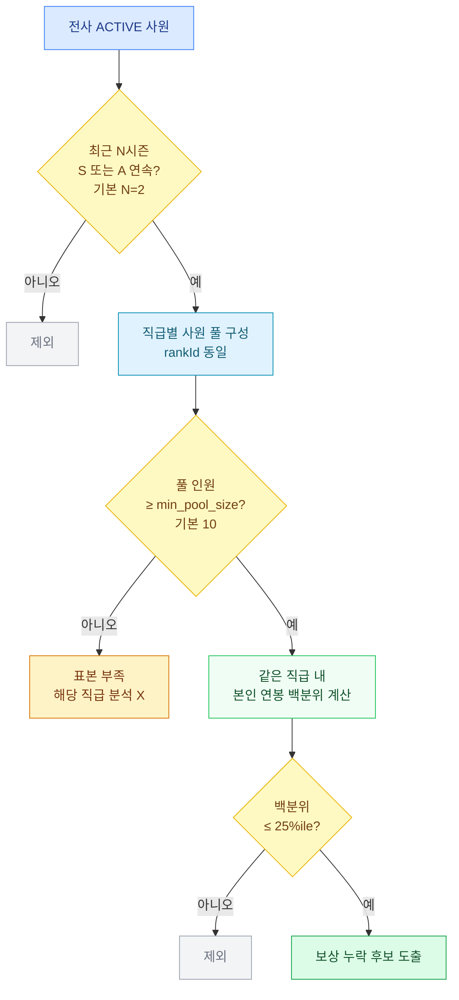

# 우수인재 보상 누락 발굴 기준

## 발굴 정의

다음 조건을 **모두** 충족하는 사원을 "보상 누락 후보"로 분류:

### 조건 1: 성과 우수
- 최근 N시즌 동안 S 또는 A 등급 수령
- 기본값 N = 2시즌 연속

### 조건 2: 같은 직급 내 보상 부족
- 같은 직급(rankId 동일) 사원 풀 안에서
- 본인 연봉 백분위가 **하위 25%ile 이하**

## 매개변수

| 매개변수 | 기본값 | 의미 |
|---------|-------|------|
| `min_seasons_a` | 2 | 최소 A 이상 등급 시즌 수 |
| `salary_percentile_threshold` | 25 | 백분위 임계치 (사분위수 Q1) |
| `min_pool_size` | 10 | 같은 직급 풀 최소 인원 |

## 사내 통상 비교 — 동적 임계치

본 시스템은 절대 임계치 대신 사내 통상값을 사용:

- 같은 직급(rankId) 내 연봉 분포의 백분위 계산
- 사원 본인 백분위가 25%ile 이하면 "하위 그룹" 분류
- 외부 권고치 인용 X, 사내 데이터 자체가 기준

## 시그널 의미

이 기준에 해당하는 사원의 패턴:
- 지속적 우수 성과 입증
- 같은 직급 동료 대비 보상 위치 하위
- HR 검토 후보 — 보상 보정 검토 대상 (단정 X)

## 권고 액션

1. 발굴 결과 = 검토 후보 목록 (즉시 처분 X)
2. HR 검토 — 보상 위치·재직 이력·등급 이력 재확인
3. 보상 보정 가능성 검토 (인사위원회 협의)
4. 결정은 권한자의 판단

## 표현 가이드 — 본문 vs AI 박스

본문 (수치만):
- "L4 직급(n=120) 내 등급 A 평균 백분위 62%ile"
- "본 후보군 평균 18%ile (Q1 미만)"

AI 참고 박스 (1줄, 객관 사실만 — 예측·권고 X):
- "후보 N명, 평균 연봉 백분위 18%ile."

## 분석 도구

- `find_underpaid_top_performers(min_seasons_a, salary_percentile_threshold)`

## 한계

1. 등급 자체의 정확성 가정 (편향 가능성 별도 분석 필요)
2. 직급 외 변수 (역할·기여도) 미반영
3. 단기 신호 — 장기 추세는 별도 분석
