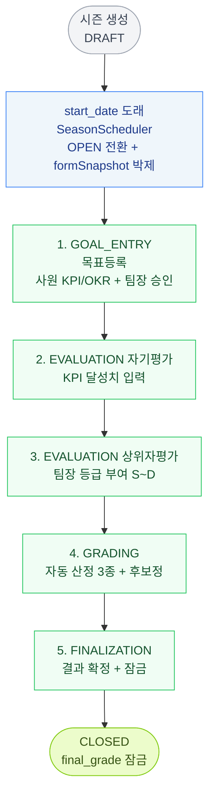

# 성과 평가 시즌 흐름

PeopleCore 의 성과 평가 시즌(반기 단위 기본)이 어떻게 시작·진행·종료되는지의 전체 그림.



## 시즌의 4가지 단계 타입

| 타입 | 의미 | 단계 수 | 주체 |
|------|-----|--------|------|
| `GOAL_ENTRY` | 목표등록 | 1 (고정) | 사원 입력 → 팀장 승인 |
| `EVALUATION` | 평가 입력 | 1~N (시즌별 가변) | 사원 자기평가 + 팀장 상위자평가 |
| `GRADING` | 등급 산정 + 후보정 | 1 | 시스템 자동 + HR 수동 |
| `FINALIZATION` | 결과 확정 + 잠금 | 1 | HR 또는 스케줄러 자동 |

평가 단계(EVALUATION)는 보통 2개 (자기평가 + 상위자평가) 로 분리하지만, 회사 정책에 따라 통합 단일 단계도 가능.

## 시즌 status 전이

```
DRAFT  ──(start_date 도래, SeasonScheduler)──▶  OPEN
                                                  │
                                                  │ 매일 자정 SeasonScheduler 가
                                                  │ Stage 시작·종료 자동 처리
                                                  │
                  ┌────── 미산정자 있으면 ─────────┤
                  ▼                              │
              알림만 발송                         │
              (OPEN 유지, 자동 확정 대기)         │
                                                  │
            ┌──── HR 수동 finalize() ────────────┤
            │                                     │
            └─── 또는 모든 사원 finalGrade 산정 ──▶  CLOSED
                                                  (formSnapshot 잠금)
```

**상태별 핵심 차이**:
| status | 가능한 동작 |
|--------|-----------|
| DRAFT | 시즌 정보·단계 일정 자유 수정. 평가자 매핑 가능. 시즌 삭제 가능. |
| OPEN | 단계 일정만 수정 가능. formSnapshot·gradeRules 등 박제 (변경 X). 시즌 삭제 X. |
| CLOSED | 모든 항목 변경 X (잠금). final_grade 영구. |

## 단계별 진행 — 상세

### 1단계: GOAL_ENTRY (목표등록)

**일정**: HR 가 시즌 생성 시 `Stage.start_date` / `Stage.end_date` 로 자유 지정. 회사·시즌별로 기간 다름.
**대상**: ACTIVE 사원 전체
**필수 활동**:
1. 사원이 KPI 등록 (필수) — 카테고리·내용·달성 기준·가중치
2. 사원이 OKR 등록 (선택) — 가이드용, 점수 산정 X
3. 팀장이 부서원 목표 검토 → 승인 또는 반려
4. KPI 가중치 합 = 100% 검증

**주의 사항**:
- ⚠ KPI 미등록·미승인 사원은 자기평가 단계에서 점수 산정 불가 → 미산정자로 분류됨
- ⚠ 단계 종료 후 (FINISHED) 추가·수정 X. 단계 진행 중에만 가능
- ⚠ KPI 가중치 합 ≠ 100% 면 저장 차단

**연결**:
- 등록된 KPI → 자기평가 단계에서 달성률 입력 항목으로 노출
- 회사 시즌 form_snapshot 의 `kpiScoring` 옵션 (cap, threshold) 이 점수 환산에 적용

### 2단계: EVALUATION — 자기평가

**일정**: HR 가 시즌 생성 시 Stage 일정으로 지정. 단계 수도 가변 (자기평가만, 자기+상위자, 또는 통합 단일 등 회사 정책).
**대상**: KPI 등록·승인 완료된 사원
**핵심 동작**:
1. 사원이 KPI 별 달성치(actual value) 입력
2. 시스템이 자동으로 KPI 점수 산출 (`kpiScoring` 환산식 사용)
3. KPI 별 가중평균 → `self_score` (0~100, 만점 100)
4. `self_evaluation` 테이블에 저장

**점수 산정 대상**: KPI 만 (OKR 은 제외 — 정성 가이드 용)

**주의 사항**:
- ⚠ 미입력 시 self_score = null → 등급 산정 시 미산정자 처리
- ⚠ 달성률이 cap (기본 120%) 을 초과하면 cap 으로 잘림
- ⚠ raw_self_score > 100 인 사원은 calibration 화면 "이상값" 으로 표시

### 3단계: EVALUATION — 상위자평가

**일정**: 자기평가 단계 종료 후로 HR 가 자유 지정. Stage 수가 통합형이면 자기·상위 한 단계에서 동시 진행도 가능.
**대상**: 자기평가 완료자 (또는 미완료자도 등급 부여 가능)
**핵심 동작**:
1. 팀장이 부서원 목록 조회
2. 각 부서원에 등급 부여 (S/A/B/C/D 중 하나)
3. 시스템이 `rawScoreTable` 로 등급 → 점수 환산 → `manager_score` 저장
4. `manager_evaluation.grade_label` 에 원래 부여한 등급 라벨 보존

**중요 — 이 시점부터 사원에게 등급 노출**:
- 상위자평가 단계 종료 (FINISHED) 즉시 — 개인·팀장·전체 결과 화면에 등급 표시
- 점수는 비공개 유지 (결과확정까지)
- 사원은 본인 등급 보고 후보정 단계에서 의견 제기 가능

**주의 사항**:
- ⚠ 부서장 본인은 같은 부서 차순위 직급이 평가 (평가자 매핑 룰)
- ⚠ 본부장 (T-HEAD = 임원) 은 평가 대상 자체에서 제외
- ⚠ 평가자가 시즌 도중 퇴사하면 차순위 직급에 자동 이양 + HR 알림

### 4단계: GRADING (등급 산정 + 후보정)

**일정**: HR 가 자유 지정. 자동 산정은 단계 진입 즉시 1회 호출, 이후 수동 후보정이 단계 종료까지 가능.
**자동 단계 (단계 진입 시 SeasonTransitionExecutor 가 즉시 호출)**:
1. **`calculateAutoGrades()`** — 가중평균 점수 산출
   - `total_score = (self × self_weight + manager × manager_weight) / 합`
   - `weighted_score` 컬럼 저장
2. **`applyBiasAdjustment()`** — Z-score 편향 보정
   - 팀별 Z-score 계산 → 전사 평균 기준 정상화
   - `manager_score_adjusted` → 다시 total_score 재계산 → `bias_adjusted_score`
3. **`applyDistribution()`** — 강제분포 적용
   - bias_adjusted_score 정렬 → 비율대로 컷 (S 10%, A 20%, ...)
   - `auto_grade` 컬럼 저장

**수동 후보정 (HR 선택)**:
- [등급산정·보정] 화면에서 일부 사원 등급 조정
- "이상 팀" 표시 (편향 보정 스킵된 팀): 소규모(인원 < 5), 표편차 0
- "clip 대상" 표시: raw_self_score > 100 사원
- 보정 시 `is_calibrated = true`, `calibration` 테이블에 사유 기록
- 보정 후 등급 비율이 gradeRules 와 맞아야 저장 가능 (검증)

**주의 사항**:
- ⚠ cohort 변경 (점수 산정 사원 수 변동) + 이전 보정 이력 있으면 → `requiresConfirm=true`. HR "재배분 확정" 후 적용
- ⚠ 편향 보정 스킵 케이스 (Z=0 / 인원<min_team_size / use_bias_adjustment=false) 는 정확도 영향 → calibration 화면에서 검토
- ⚠ 보정 안 하면 auto_grade 가 그대로 final_grade 로 복사됨

### 5단계: FINALIZATION (결과 확정)

**일정**: HR 가 자유 지정. 시즌 end_date 까지 수동 확정 가능, end_date 경과 + 미산정자 0명이면 자동 확정.
**HR 동작**:
1. [최종확정] 화면 진입
2. 미산정자 명단 확인 (auto_grade 가 null 인 사원)
3. 미산정자 처리 (수동 등급 부여 or 분석 제외 ack)
4. "최종 확정" 클릭 → `EvalGradeService.finalize()`

**자동 처리**:
- `final_grade` 잠금 (`locked_at` 기록)
- `season.finalizedAt` 기록
- `season.status = CLOSED`
- 사원 알림 발송 + 점수 공개

**자동 확정 vs 수동**:
- 시즌 end_date 경과 + 미산정자 0명 → SeasonScheduler 가 자동 finalize
- 미산정자 있으면 자동 X. HR 알림만 반복 발송 + OPEN 유지

**주의 사항**:
- ⚠ 미산정자 처리 못 한 채 시즌 종료일 경과 시 자동 확정 안 됨 — HR 가 매일 체크
- ⚠ 확정 후 등급 변경 불가 — 이의는 다음 시즌에서 calibration 으로
- ⚠ 점수 공개 시 사원 화면에 self/manager/total/bias_adjusted/final 모두 노출됨

## 자동 전이 (SeasonScheduler)

매일 자정에 실행:

| 이벤트 | 처리 |
|-------|------|
| Season.start_date == 오늘 | DRAFT → OPEN (formSnapshot 박제 + EvalGrade 행 박제) |
| Stage.start_date == 오늘 | WAITING → IN_PROGRESS |
| GRADING 단계 진입 | 자동 산정 3종 호출 (calculateAutoGrades / applyBiasAdjustment / applyDistribution) |
| Stage.end_date < 오늘 | IN_PROGRESS → FINISHED |
| Season.end_date < 오늘 + 미산정자 0 | OPEN → CLOSED 자동 확정 |
| Season.end_date < 오늘 + 미산정자 N | HR 알림만 발송, OPEN 유지 |

## 시즌 OPEN 시 박제되는 것 (formSnapshot)

OPEN 전환 순간 `Season.formSnapshot` 에 박제 (이후 시즌 종료까지 변경 불가):

| 항목 | 의미 | 변경 가능 시점 |
|------|------|--------------|
| `itemList` | 자기/상위 평가 가중치 | DRAFT 까지만 |
| `gradeRules` | 강제분포 비율 (S/A/B/C/D %) | DRAFT 까지만 |
| `rawScoreTable` | 등급 → 원점수 환산 | DRAFT 까지만 |
| `kpiScoring` | KPI 달성률 환산 (cap/threshold/factor) | DRAFT 까지만 |
| `useBiasAdjustment` | Z-score 보정 사용 여부 | DRAFT 까지만 |
| `minTeamSize` | 편향 보정 최소 팀 인원 | DRAFT 까지만 |

→ **시즌 도중 규칙 변경 X.** 다음 시즌 등록 시 새 규칙으로 적용.

## EvalGrade 행 박제 (사원 단위 시즌 데이터)

OPEN 전환 순간 ACTIVE 사원 × 시즌 별로 EvalGrade 행 생성:

| 컬럼 | 박제값 |
|------|--------|
| `evaluator_id_snapshot` | 시즌 시작 시점 평가자 매핑 |
| `dept_id_snapshot` | 그 시점 부서 |
| `position_snapshot` | 그 시점 직급 |
| `is_excluded` | 평가 제외 플래그 (퇴사·휴직) |

→ 시즌 도중 부서 이동·직급 변경이 있어도 박제값 기준으로 평가 진행.

## 흔한 시나리오·주의 처리

| 상황 | 처리 |
|-----|------|
| 시즌 OPEN 후 신규 입사자 | 평가자 자동 매핑 X → HR 알림 + 수동 매핑 필요 |
| 평가 단계 진행 중 사원 부서 이동 | 박제된 dept/평가자 기준으로 평가 진행 |
| 평가 단계 진행 중 평가자 퇴사 | 차순위 직급에 자동 이양 + HR 알림 |
| 평가 단계 진행 중 사원 퇴사 | EvalGrade.is_excluded=true, 평가 제외 |
| 자동 산정 후 점수 이상 발견 | calibration 화면에서 수동 보정 |
| 강제분포 비율 어긋난 보정 시도 | 검증 실패 → 400 → DB 미변경 |
| 미산정자 처리 못 한 채 종료일 경과 | 자동 확정 X, OPEN 유지 + HR 알림 반복 |
| 확정 후 등급 변경 필요 | 시즌 CLOSED 면 변경 X — 다음 시즌 보정으로 |
| cohort 변경 후 재배분 | confirm 필요 → 보정 이력 삭제 + 재시작 |

## 권한 매트릭스 (간단)

| 작업 | 권한 |
|------|------|
| 시즌 생성·DRAFT 수정 | HR_ADMIN |
| 자동 산정 수동 트리거 | HR_ADMIN |
| 보정 저장 | HR_ADMIN |
| 최종 확정 | HR_ADMIN |
| 본인 등급·점수 조회 | 사원 본인 (단계별 노출 룰 따름) |
| 팀 등급 조회 | 팀장 |
| 전사 등급 조회 | HR_ADMIN |
