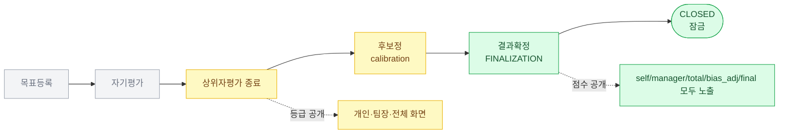

# 등급·점수 노출 시점

성과 평가 단계별 등급/점수 공개 시점.

## 단계별 노출 표

| 단계 | 등급 | 점수 |
|------|-----|-----|
| 목표등록 | X | X |
| 자기평가 | X | X |
| **상위자평가 끝** | **공개** (개인·팀장·전체) | X |
| 후보정 (calibration) | 공개 | X |
| **결과확정** | 공개 (잠금) | **공개** |

## 등급 노출 — 상위자평가 끝나는 즉시

이 시점부터:
- **개인 화면**: 본인 등급 표시
- **팀장 화면**: 팀원 등급 모두 표시
- **전체 결과 화면**: 전 사원 등급 표시

목적: 사원이 본인 등급 확인하고 후보정 단계 전에 의견 정리할 수 있도록.

## 점수 비공개 유지 — 후보정까지

후보정 단계에서 등급은 보이나 점수는 비공개.
이유: 점수는 강제분포·편향 보정 전 값이라 변동 가능. 확정 전 노출 시 혼란.

## 점수 공개 — 결과확정 이후

`final_grade` 잠금과 동시에 점수도 공개.
- self_score (자기평가)
- manager_score (상위자평가)
- manager_score_adjusted (Z보정 후)
- total_score (가중 합)
- bias_adjusted_score (편향 보정 후)
- final_grade (강제분포 후)

## 시즌 status 변화

- 5단계 진입 시: 진행 중 (OPEN)
- 결과확정 완료: CLOSED + final_grade 잠금
