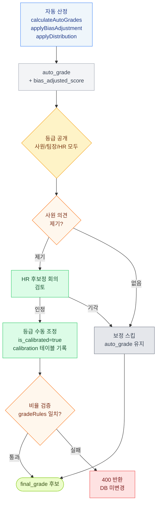

# 후보정 (Calibration)

상위자평가 종료 후 ~ 결과확정 전 사이의 등급 조정 단계.



## 자동 보정 (autoGrade)

시스템이 산출하는 단계 — 별도 조작 X.

### 단계별 계산

```
1. manager_score_adjusted = manager_score ± Z-score 보정
   (Z-score 가 큰 평가자의 점수 정상화)

2. total_score = self_score × 0.3 + manager_score_adjusted × 0.7
   (가중치는 시즌 form_snapshot 의 itemList.weight 기반)

3. bias_adjusted_score = total_score ± 편향 보정
   (편향 큰 사원·평가자 추가 보정)

4. auto_grade 산출 (점수 기반 매핑)
```

### 보정 안 하면

`auto_grade` 가 그대로 `final_grade` 가 됨.

## 수동 보정 (회의·검토)

후보정 단계 기간 내 회의체에서 일부 사원 등급 조정.

### 트리거
- 사원이 본인 등급 보고 의견 제기 (별도 시스템 X, 팀장·HR 직접 소통)
- 회의체에서 평가 균형 조정 필요 판단

### 동작
- 등급 한 단계 상향 또는 하향 (예: C → B)
- `is_calibrated = true` 표시
- `calibration` 테이블에 사유 + 변경 이력 기록
- 변경된 등급이 `final_grade` 후보가 됨

## 이의신청 받는 기간

별도 이의신청 시스템 X.
**후보정 단계 = 등급 공개된 상태이므로 사원이 본인 등급 확인하고 이의 제기 가능한 기간**.

처리 흐름:
1. 사원: 본인 등급 확인 → 팀장·HR 에 의견
2. 팀장·HR: 후보정 회의에서 검토
3. 인정 시: 수동 보정 (등급 조정)
4. 기각 시: 그대로 (autoGrade 가 final 됨)

## 편향 보정 — 주의 사항 (분석 정확도 영향)

다음 케이스는 편향 보정 결과가 부정확하거나 무의미할 수 있음.

### 1. Z-score = 0 (변별력 0)
- 평가자가 모든 사원에게 같은 점수만 부여 → 표준편차 0
- 결과: Z-score 계산 시 분모 0 → 보정 불가
- 시스템 처리: 보정 X, manager_score 그대로
- 분석 의미: 그 평가자의 변별력 자체가 없다는 시그널

### 2. 소규모 (표본 부족)
- 평가자가 평가한 사원 수가 적으면 (예: 3~5명 미만)
- 통계적 의미 없음 → Z-score 신뢰도 낮음
- 시스템 처리: min_evaluatees 미만이면 분석 제외 또는 신뢰도 표시
- 분석 의미: 결과 단정 X, 정성 검토 필요

### 3. 자기평가 점수 100 초과 (이상값)
- self_score 가 정상 범위 (0~100) 벗어남 → 입력 오류 가능성
- 시스템 처리: 비정상 값으로 표시, 계산 제외 또는 로그
- 분석 의미: 데이터 정합성 검토 필요 (사원 입력 실수 또는 시스템 버그)

→ 위 케이스는 분석 결과에 "주의" 라벨로 표시되며, 정성 검토 권고.
