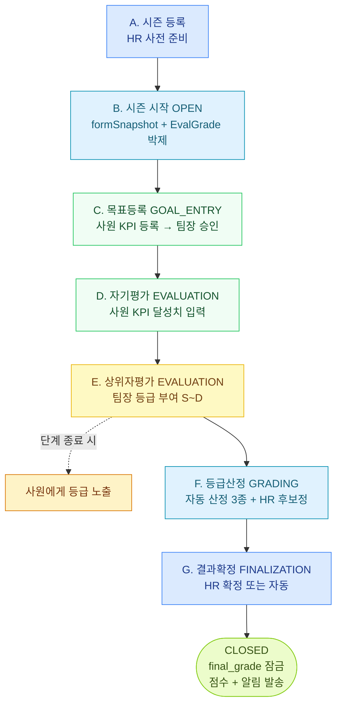

# 성과평가 종합 안내

처음 보는 사람이 한 문서로 시즌 흐름·규칙·옵션·주의사항을 다 잡을 수 있게.
세부는 각 doc 참조 (R-01~03 / U-01~04 / P-01~03).

## 1. 큰 그림 — 한 시즌이 어떻게 흘러가나



상세 흐름: [P-01 성과 평가 시즌 흐름]

## 2. 핵심 규칙 4종 + 어디서 설정·언제 박제

| 규칙 | 의미 | 어디서 | 언제 박제 | 변경하려면 |
|------|------|--------|-----------|------------|
| **itemList** | 자기/상위 평가 가중치 (예: 30/70) | 시즌 등록 | OPEN 시 | 다음 시즌 |
| **gradeRules** | 강제분포 비율 (S 10/A 20/B 40/C 20/D 10) | 시즌 등록 | OPEN 시 | 다음 시즌 |
| **rawScoreTable** | 등급 → 점수 환산 (S=95, A=85, ...) | 시즌 등록 | OPEN 시 | 다음 시즌 |
| **kpiScoring** | KPI 달성률 환산 (cap, threshold, factor) | 시즌 등록 | OPEN 시 | 다음 시즌 |
| **편향 보정 옵션** | useBiasAdjustment / biasWeight / minTeamSize | 시즌 등록 | OPEN 시 | 다음 시즌 |
| **평가자 매핑** | 사원 → 평가자 (부서장 룰) | [평가자 관리] | (글로벌) | 시즌 종료 후 |

상세: [R-01 강제분포] · [R-02 점수 계산식·Z-score] · [R-03 평가자 매핑]

## 3. 점수 흐름 (가장 자주 헷갈리는 부분)

```
KPI 달성률 (사원 입력)
    ↓ kpiScoring 환산 (cap, threshold)
self_score (자기평가, 0~100)

상위자가 등급 부여 (S/A/B/C/D)
    ↓ rawScoreTable 환산
manager_score (0~100)

    ↓ Z-score 보정 (useBiasAdjustment + biasWeight + minTeamSize)
manager_score_adjusted

    ↓ itemList 가중치
total_score = self×weight_self + adjusted×weight_manager

    ↓ 추가 편향 보정
bias_adjusted_score

    ↓ rawScoreTable 매핑
auto_grade (시스템 산출)

    ↓ HR 수동 후보정 (선택)
calibrated_grade (보정 시)

    ↓ 강제분포 (gradeRules) 적용
final_grade (잠금)
```

상세 식: [R-02 점수 계산식·Z-score]

## 4. 어디에 뭘 주의해야 하나 (자주 발생하는 함정)

### 시즌 등록·시작
- ⚠ 평가자 미지정 사원 1명이라도 있으면 시즌 생성 차단 → [평가자 관리] 먼저
- ⚠ DRAFT 까지만 formSnapshot 변경 가능. OPEN 후엔 박제됨
- ⚠ OPEN 시즌은 같은 회사에 1개만 (단일 OPEN 강제)

### 목표등록 (GOAL_ENTRY)
- ⚠ KPI 가중치 합 ≠ 100% 면 저장 차단
- ⚠ 단계 종료 후엔 KPI 추가·수정 X (스토어 내부 잠금)
- ⚠ KPI 미등록·미승인자는 자기평가 단계에서 점수 산정 불가

### 자기평가
- ⚠ 달성률이 cap 초과하면 cap 으로 절단됨 (cap=120 권장)
- ⚠ raw_self_score > 100 인 사원은 calibration 화면 "이상값" 표시
- ⚠ OKR 은 점수 산정 X (정성 가이드 용)

### 상위자평가
- ⚠ 부서장 본인은 같은 부서 차순위 직급이 평가
- ⚠ 본부장 (T-HEAD) 은 평가 대상 자체 X
- ⚠ 단계 종료 즉시 사원에게 등급 노출 (점수는 결과확정까지 비공개)

### 등급산정 (GRADING)
- ⚠ 단계 진입 시 자동 산정 3종이 즉시 호출됨 — 그 전에 상위자평가 모두 완료 필수
- ⚠ 편향 보정 스킵 케이스 (Z=0 / 인원<5 / 표편차 0) 는 calibration 화면 "이상 팀" 표시
- ⚠ 후보정 후 등급 비율이 gradeRules 와 안 맞으면 저장 차단 (검증)
- ⚠ cohort 변경 시 `requiresConfirm=true` — HR "재배분 확정" 필요

### 결과확정 (FINALIZATION)
- ⚠ 미산정자 처리 못 한 채 종료일 경과 시 자동 확정 X (OPEN 유지 + HR 알림 반복)
- ⚠ 확정 후엔 등급 변경 불가. 이의는 다음 시즌으로

### 평가자·사원 변경 (시즌 진행 중)
- ⚠ 시즌 도중 부서 이동: 박제된 dept_id_snapshot 으로 평가
- ⚠ 시즌 도중 사원 퇴사: EvalGrade.is_excluded=true, 평가 제외
- ⚠ 시즌 도중 평가자 퇴사: 차순위 직급 자동 이양 + HR 알림
- ⚠ 시즌 OPEN 후 신규 입사자: 평가자 자동 매핑 X → 수동 매핑 필요

## 5. 사원 시점 — 단계별 보이는 화면

| 단계 | 사원 화면 | 팀장 화면 | HR 화면 |
|------|----------|----------|---------|
| 목표등록 | KPI 등록 폼 | 부서원 KPI 승인 | 진행률 모니터 |
| 자기평가 | KPI 달성치 입력 | (대기) | 진행률 모니터 |
| 상위자평가 | (대기) | 부서원 등급 부여 | 진행률 모니터 |
| 상위자평가 끝 | **본인 등급 표시** | **팀원 등급 표시** | **전사 등급** |
| 후보정 | 등급 표시 (점수 X) | 팀원 등급 | calibration 화면 |
| 결과확정 | (잠금 직전) | (잠금 직전) | 미산정자 처리 |
| CLOSED | **점수+등급 모두 공개**, 알림 수신 | 팀원 점수+등급 | 전체 결과·잠금 |

상세: [P-02 등급·점수 노출 시점]

## 6. 후보정 (Calibration) — 이의 처리 흐름

별도 이의신청 시스템 X. 상위자평가 종료 후 등급이 노출된 상태에서 사원이 의견 제기 → HR·팀장 회의에서 검토.

```
사원: 본인 등급 확인 → 팀장·HR 에 직접 의견 (메일·메신저·면담)
HR: 후보정 회의에서 검토
  ├─ 인정 → 수동 보정 (calibration)
  └─ 기각 → autoGrade 그대로 final
```

→ "이의신청 받는 기간" = **GRADING 단계 IN_PROGRESS 기간**.
상세: [P-03 후보정·자동·수동·이의 처리]

## 7. 분석에 어떻게 연결되나

| 분석 도구 | 사용 데이터 | 어떤 규칙·옵션의 영향을 받나 |
|----------|-----------|----------------------------|
| #1 보상-성과 정합성 | final_grade × 보상 | gradeRules (전사 비율), rawScoreTable |
| #2 우수인재 보상 누락 | grades_seq + 연봉 백분위 + 진급 이력 | 매 시즌의 final_grade 누적 |
| #4 부서별 등급 분포 | final_grade × 부서 | gradeRules 적용 후에도 부서 차이 가시화 |
| #5 평가자 점수 분포 (편향) | manager_score, Z-score | useBiasAdjustment / biasWeight / minTeamSize |
| #6 등급 변동 패턴 | 시즌별 final_grade 시계열 | 매 시즌 강제분포가 일관 적용된 가정 |
| #7 워라밸 | 근태 (시즌 무관) | — |
| #9 산업안전 | 근태 + 법규 (시즌 무관) | — |
| #12 종합 진단 | 위 7개 결합 | 위 모두 |

## 8. 자주 찾는 항목 빠르게

- 강제분포 비율은 어디서 보나? → [R-01]
- Z-score 가 뭐고 어떻게 보정되나? → [R-02]
- 시즌 어떻게 만드나? → [U-01]
- 부서장 본인은 누가 평가하나? → [R-03]
- KPI 어떻게 등록하나? → [U-02]
- 시즌 도중 사원 퇴사하면? → [U-03]
- 미산정자 어떻게 처리하나? → [U-04]
- 등급 언제 보이나? → [P-02]
- 이의신청은? → [P-03]
- 단계별 자동 산정은 무엇인가? → [P-01], [U-04]
