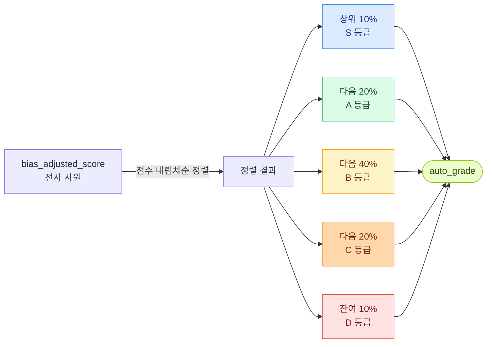

# 강제분포 규칙 (gradeRules)

전사 차원에서 등급 비율을 강제로 맞추는 규칙. 결과확정 단계에서 적용.
"평가가 후한·박한 부서를 전사 평균에 정상화" 하는 효과.



## 1. 항목 구조

`form_snapshot.gradeRules` 는 등급별 행 5개 (S/A/B/C/D) 의 배열.
각 행의 필드:

| 필드 | 타입 | 의미 |
|-----|-----|------|
| `id` | string | 등급 ID (S/A/B/C/D — 변경 권장 X) |
| `label` | string | 화면 표시 라벨 |
| `ratio` | number | 0~100, 그 등급의 비율 (%) |

기본 비율:

| 등급 | ratio | 의미 |
|-----|-----|------|
| S | 10 | 최우수 (상위 10%) |
| A | 20 | 우수 |
| B | 40 | 통상 (중간) |
| C | 20 | 미흡 |
| D | 10 | 부진 |

**제약**: 5개 항목의 ratio 합 = **반드시 100**. 합이 100 이 아니면 시즌 생성 단계에서 차단.

## 2. 어디서 설정·언제 박제

| 시점 | 동작 |
|------|-----|
| **시즌 등록 (DRAFT)** | [성과평가] → [평가 설계] → [시즌 생성] 화면에서 입력. 자유 수정 가능 |
| **시즌 OPEN 전환** | `formSnapshot.gradeRules` 에 박제 (이후 변경 X) |
| **시즌 진행 중** | 박제값으로 GRADING 단계에서 자동 적용 |
| **CLOSED** | 영구 잠금 |

**다음 시즌 적용**: 비율 변경하려면 다음 시즌 등록 시 새 비율 입력. 기존 시즌은 기존 비율 유지.

## 3. 적용 시점·동작 방식

```
[자기평가 + 상위자평가] (EVALUATION 단계)
        ↓
auto_grade 산출 (calculateAutoGrades)
        ↓
manager_score_adjusted (Z-score 보정, applyBiasAdjustment)
        ↓
bias_adjusted_score 산출
        ↓
강제분포 적용 (applyDistribution) ← 여기서 gradeRules 사용
        ↓
auto_grade 컬럼에 등급 저장
        ↓
HR 수동 보정 (선택, calibration)
        ↓
final_grade (잠금)
```

**applyDistribution() 내부 로직**:
1. 사원을 `bias_adjusted_score` 내림차순 정렬 (동점 시 weighted_score 보조 정렬)
2. gradeRules 비율대로 위에서 컷:
   - 상위 ratio[S]% → S
   - 다음 ratio[A]% → A
   - ...
   - 마지막 등급은 잔여 인원 (반올림 차이 흡수, 정합성 유지)
3. 컷 점수 동점자는 상위 등급으로 흡수 (미세 비율 초과 허용)
4. 결과를 `auto_grade` 에 저장

## 4. 회사별 다른 비율 — 예시

`form_snapshot.gradeRules` 가 시즌별로 다를 수 있음.

**보수적인 회사 (S 적게)**:
```json
"gradeRules": [
  {"id":"S","label":"S","ratio":5},
  {"id":"A","label":"A","ratio":15},
  {"id":"B","label":"B","ratio":50},
  {"id":"C","label":"C","ratio":20},
  {"id":"D","label":"D","ratio":10}
]
```

**평가가 후한 회사 (S/A 많이)**:
```json
"gradeRules": [
  {"id":"S","label":"S","ratio":15},
  {"id":"A","label":"A","ratio":30},
  {"id":"B","label":"B","ratio":35},
  {"id":"C","label":"C","ratio":15},
  {"id":"D","label":"D","ratio":5}
]
```

## 5. 적용 후 결과의 특성

- **전사 분포**: 정확히 비율대로 (반올림 차이 ±1명 정도)
- **부서별 분포**: 다를 수 있음 — 우수한 부서가 S/A 더 많이 받음 (정상)
- **소규모 회사 (전체 사원 < 50)**: 비율 정밀도 낮아짐 (10% 가 정확히 5명 같은 식이 안 됨)

## 6. 주의 사항

| 상황 | 주의 |
|------|------|
| 비율 합 ≠ 100 | 시즌 생성 차단 (FE/BE 검증) |
| 등급 ID 추가/삭제 | gradeRules · rawScoreTable · 화면 표시 모두 영향 — 변경 권장 X |
| 시즌 도중 비율 수정 시도 | OPEN 후엔 박제됨 → 변경 X. 다음 시즌에서 |
| 보정 후 비율 어긋난 저장 시도 | 비율 검증 실패 → 400 → DB 미변경 |
| 시즌 중 cohort 변경 (사원 추가/제외) | 재배분 시 `requiresConfirm=true`. HR "재배분 확정" 필요 |
| HR 가 등급을 강하게 보정 | 보정 결과도 비율 검증 거침 — 비율 깨지면 저장 불가 |

## 7. 분석에 미치는 영향

- **#4 (부서별 등급 분포)**: 강제분포 적용 후에도 부서별 차이를 가시화 (편중 부서 식별)
- **#1 (보상-성과 정합성)**: 전사 비율은 강제이지만, 직급 내 등급-연봉 변별력을 별도 검증
- **#5 (평가자 점수 분포)**: 강제분포 전 평가자 raw 점수의 편향을 진단 (Z-score 기반)
- **#6 (등급 변동 패턴)**: 강제분포가 매 시즌 적용되므로, 같은 사원의 시즌간 등급 변동이 의미있는 시그널

## 8. FAQ

**Q: 강제분포 안 쓰고 싶음. 어떻게?**
A: 현재 시스템은 강제분포 항상 적용. 비율을 모두 균등 (예: S 20/A 20/B 20/C 20/D 20) 해도 결국 컷이 발생. 완전 무적용은 별도 시즌 옵션이 추가되어야 함.

**Q: 강제분포 후에도 우리 부서가 너무 박하게 나옴. 어쩌지?**
A: 후보정 (calibration) 단계에서 일부 사원 등급 수동 상향 가능. 단, 다른 사원 하향이 있어야 비율 검증 통과.

**Q: 비율을 시즌 진행 중 바꾸면?**
A: OPEN 상태부터는 formSnapshot 에 박제되어 변경 X. 다음 시즌부터 적용.

**Q: 5단계 컷에서 정확히 비율이 안 맞으면?**
A: 마지막 등급(D)이 잔여 인원을 흡수해 ±1명 오차로 정합성 유지.
