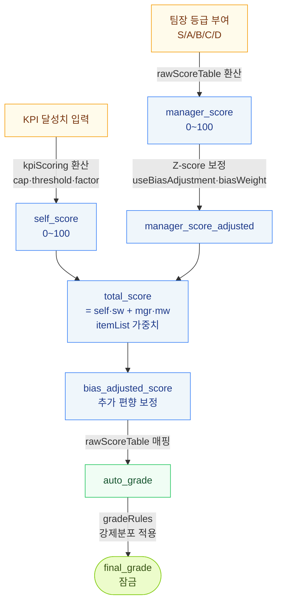

# 점수 계산식 + Z-score

자기평가 + 상위자평가 → 최종 등급까지의 점수 흐름. 어디서 어떤 옵션이 쓰이는지.



## 1. 전체 흐름 한눈에

```
KPI 달성률 입력
    ↓ kpiScoring 환산 (cap, threshold, factor)
self_score (자기평가 점수, 0~100)

상위자가 등급 부여 (S/A/B/C/D)
    ↓ rawScoreTable 환산
manager_score (상위자평가 점수, 0~100)

    ↓ Z-score 보정 (useBiasAdjustment + biasWeight)
manager_score_adjusted

    ↓ itemList 가중치 (self_weight + manager_weight)
total_score

    ↓ 추가 편향 보정 (사원·평가자 별 신호)
bias_adjusted_score

    ↓ rawScoreTable 매핑
auto_grade (점수 → 등급)

    ↓ 강제분포 (gradeRules)
final_grade (잠금)
```

각 단계는 form_snapshot 의 특정 옵션에 의존 → 회사·시즌별 차이 가능.

## 2. self_score — 자기평가 점수

### 입력
사원이 KPI 별로 달성치(actual) 입력 → KPI 별 달성률 = actual / target.

### 환산식 (kpiScoring 옵션)
```json
"kpiScoring": {
  "cap": 120,
  "scaleTo": 100,
  "maintainTolerance": 0,
  "underperformanceThreshold": 0,
  "underperformanceFactor": 1.0
}
```

| 옵션 | 의미 | 영향 |
|------|------|------|
| `cap` | 달성률 상한 (%) | 120% 라면 130% 입력해도 120 으로 절단 |
| `scaleTo` | 정규화 점수 만점 | 보통 100 |
| `maintainTolerance` | MAINTAIN 방향 KPI 허용 오차 (%) | "유지" 목표는 ±오차 안에 있으면 만점 |
| `underperformanceThreshold` | 미달 패널티 발동 임계 (%) | 50% 미만이면 패널티 시작 |
| `underperformanceFactor` | 미달 시 배율 | 0.5 면 점수 절반 |

### 산출
```
self_score = Σ (KPI별 환산점수 × KPI 가중치) / 가중치 합
```

KPI 가중치는 사원이 GOAL_ENTRY 단계에서 등록 (가중치 합 = 100% 강제).

### 주의
- ⚠ raw_self_score 가 100 을 초과하는 경우 (cap 누락 시) → calibration 화면에 "이상값" 으로 표시
- ⚠ KPI 미입력 사원 → self_score = null → 미산정자 분류
- ⚠ OKR 은 self_score 산정에서 제외 (정성 가이드 용)

## 3. manager_score — 상위자평가 점수

### 입력
팀장이 부서원에게 등급(S/A/B/C/D) 부여.

### 환산 (rawScoreTable 옵션)
```json
"rawScoreTable": [
  {"gradeId":"S","rawScore":95},
  {"gradeId":"A","rawScore":85},
  {"gradeId":"B","rawScore":75},
  {"gradeId":"C","rawScore":65},
  {"gradeId":"D","rawScore":50}
]
```

→ 팀장이 'A' 부여하면 manager_score = 85.

### 회사 정책에 따라 다름
일부 회사는 더 박하게 (S=90, A=80, ...) 또는 후하게 설정 가능.

### 주의
- ⚠ 팀장이 평가 안 한 사원 → manager_score = null → 미산정자 분류
- ⚠ 팀장 본인은 같은 부서 차순위 직급이 평가 (평가자 매핑 룰)

## 4. Z-score 가 뭐야 — 평가자 편향 보정 핵심

Z-score = 한 값이 평균으로부터 얼마나 떨어져있는지 표준편차 단위로 표현.

```
Z = (값 - 평균) / 표준편차
```

### 예시 — 평가자 점수 분포
- 전사 평가자 평균 점수 = 3.42
- 전사 표준편차 = 0.28
- 평가자 E-021 의 평균 점수 = 4.05
- E-021 의 Z-score = (4.05 - 3.42) / 0.28 = **+2.25**

→ E-021 은 전사 평균보다 2.25σ 높게 점수 부여 (매우 후한 평가자).

### Z-score 의미

| Z-score | 해석 |
|---------|------|
| +2 이상 | 매우 후한 평가자 |
| +1 ~ +2 | 후한 편 |
| -1 ~ +1 | 통상 범위 |
| -2 ~ -1 | 박한 편 |
| -2 이하 | 매우 박한 평가자 |

### 보정 산식 (manager_score_adjusted)
```
manager_score_adjusted = manager_score - (Z_evaluator × biasWeight)
```

- `Z_evaluator` = 그 평가자의 Z-score
- `biasWeight` = form_snapshot 의 옵션 (기본 1.00)

→ 후한 평가자(Z=+2)의 점수는 낮아짐. 박한 평가자(Z=-2)의 점수는 높아짐.

### 보정 옵션 (form_snapshot)
```json
{
  "useBiasAdjustment": true,
  "biasWeight": 1.00,
  "minTeamSize": 5
}
```

| 옵션 | 의미 | 기본 |
|------|------|------|
| `useBiasAdjustment` | 보정 사용 여부 | true |
| `biasWeight` | 보정 강도 (0~1.5 권장) | 1.00 |
| `minTeamSize` | 보정 적용 최소 팀 인원 | 5 |

### 보정 스킵 조건 (주의)

| 조건 | 처리 | 영향 |
|------|------|------|
| 팀 인원 < `minTeamSize` (기본 5) | 보정 스킵, 원점수 유지 | 분석 정확도 영향 — calibration 화면에 "이상 팀" 표시 |
| 팀 표편차 = 0 (전원 동점) | 보정 불가 (분모 0), 원점수 유지 | "변별력 0" 시그널 — 별도 검토 |
| `useBiasAdjustment = false` | 보정 자체 스킵 | 회사 정책 |
| `manager_score = null` | 평가 미입력자 — 보정 대상 X | 미산정자 |

→ 위 케이스는 calibration 화면의 "이상 팀" 으로 표시됨. HR 수동 검토 필요.

## 5. total_score — 자기 + 상위 가중 합

```
total_score = self_score × self_weight + manager_score_adjusted × manager_weight
```

### 가중치 (itemList 옵션)
```json
"itemList": [
  {"id":"self","name":"자기평가","weight":30,"locked":true,"enabled":true},
  {"id":"manager","name":"상위자평가","weight":70,"locked":true,"enabled":true}
]
```

| 옵션 | 의미 |
|------|------|
| `weight` | 각 항목의 가중치. 합 = 100 |
| `locked` | 시즌 진행 중 변경 잠금 |
| `enabled` | 비활성화 (예: 자기평가 안 쓰는 회사) |

### 회사별 변형
- 자기평가 30 + 상위자평가 70 (기본)
- 자기평가 50 + 상위자평가 50 (균형형)
- 자기평가 0 + 상위자평가 100 (상위자 전권)

→ 시즌 OPEN 후엔 박제. 변경하려면 다음 시즌.

## 6. bias_adjusted_score — 추가 편향 보정

```
bias_adjusted_score = total_score ± 추가 보정
```

추가 보정은 사원·평가자별 다른 편향 신호 반영 (회사별 룰):
- 평가자가 본인 부서원에게 일관되게 후한 경우
- 사원이 자기평가에서 일관되게 후한 경우
- 평가자 풀이 작은 부서의 신뢰도 가중 등

→ 결과를 `bias_adjusted_score` 컬럼에 저장.

## 7. auto_grade — 점수 → 등급

`bias_adjusted_score` 를 `rawScoreTable` 기준으로 매핑:

```
≥ 95 → S
≥ 85 → A
≥ 75 → B
≥ 65 → C
< 65 → D
```

이 결과를 `auto_grade` 컬럼에 저장. 이후 강제분포 (gradeRules) 가 추가 적용됨 → final_grade.

## 8. 옵션 변경 = 어디서 / 누가 / 언제

| 옵션 | 화면 | 누가 | 언제 |
|------|------|------|------|
| itemList (가중치) | [평가 설계] → 시즌 생성 | HR_ADMIN | DRAFT 까지만 |
| gradeRules (분포) | [평가 설계] → 시즌 생성 | HR_ADMIN | DRAFT 까지만 |
| rawScoreTable (등급→점수) | [평가 설계] → 시즌 생성 | HR_ADMIN | DRAFT 까지만 |
| kpiScoring (KPI 환산) | [평가 설계] → 시즌 생성 | HR_ADMIN | DRAFT 까지만 |
| useBiasAdjustment | [평가 설계] → 시즌 생성 | HR_ADMIN | DRAFT 까지만 |
| biasWeight, minTeamSize | [평가 설계] → 시즌 생성 | HR_ADMIN | DRAFT 까지만 |

→ **시즌 OPEN 후엔 모두 박제 (formSnapshot)**. 변경 시 다음 시즌부터 적용.

## 9. 분석에 어떻게 활용

| 분석 | 사용 점수·옵션 |
|------|-------------|
| **#5 평가자 점수 분포 (편향)** | manager_score 와 Z-score |
| **#1 보상-성과 정합성** | final_grade × 보상 정보 |
| **#6 등급 변동 패턴** | 시즌별 final_grade 시계열 |
| **#4 부서별 등급 분포** | final_grade × 부서 |

## 10. FAQ

**Q: Z-score 보정을 끄려면?**
A: 시즌 등록 시 `useBiasAdjustment: false`. 그 시즌은 manager_score 가 그대로 manager_score_adjusted 로 사용됨.

**Q: 우리 회사는 자기평가 안 씀.**
A: itemList 에서 `self.enabled = false` 또는 `self.weight = 0` + `manager.weight = 100` 으로 설정.

**Q: 등급 환산표를 박하게 바꾸면?**
A: rawScoreTable 의 rawScore 값을 모두 낮추면 됨 (예: S=90, A=80, ...). 점수 산정이 박해지지만 강제분포로 결국 비율은 같음.

**Q: KPI 미입력 사원도 등급 부여 가능?**
A: 팀장이 등급 부여하면 manager_score 는 있지만 self_score = null → total_score = null → 미산정자. 후보정에서 수동 등급 부여 필요.
