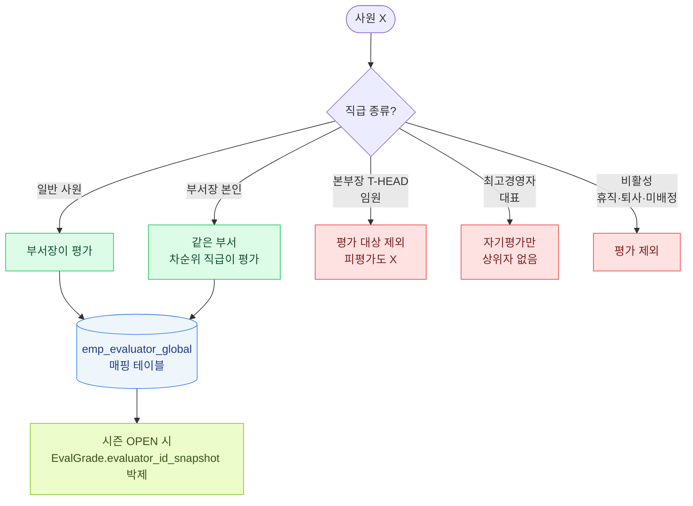

# 평가자 매핑 룰

각 사원에게 "누가 평가자(상위자)인지" 결정하는 규칙.



## 기본 룰

```
평가자 = 같은 부서의 최고 직급 사원 (= 부서장)
```

### 세부 규칙

1. **일반 사원** → 부서의 부서장이 평가
2. **부서장 본인** → 같은 부서의 차순위 직급 사원이 평가
3. **본부장 (T-HEAD = 임원)** → 평가 대상에서 제외 (피평가도 X)
4. **최고경영자 (대표)** → 자기평가만 (상위자 없음)
5. **비활성 사원 (휴직·퇴사·미배정)** → 평가 제외

## 매핑 데이터

`emp_evaluator_global` 테이블:

| 컬럼 | 의미 |
|------|------|
| `company_id` | 회사 |
| `evaluatee_emp_id` | 피평가자 (사원) |
| `evaluator_emp_id` | 평가자 (보통 부서장) |
| `is_excluded` | 평가 제외 여부 (true 면 평가 진행 X) |

## 시즌 시작 전 — 평가자 사전 지정 필수

**시즌 등록 전에 모든 사원의 평가자가 emp_evaluator_global 에 매핑되어 있어야 함.**
- 매핑 안 된 사원이 있으면 시즌 등록 시 경고
- 일괄 자동 매핑 (부서장 룰) + 수동 조정 가능

## 시즌 진행 중 — 평가자 누락 처리

시즌 OPEN 후 (대기 → 오픈 사이) 신규 입사한 사원은 평가자 자동 매핑 X.

### 처리
1. 신규 입사자 발견 (스케줄러 또는 수동)
2. 알림 발송: "평가자 미지정 사원 N명"
3. HR 가 OPEN 상태에서 수동 매핑 (가능)
4. 매핑 후 평가 진행

## 부서 이동 / 퇴사 처리

### 부서 이동
- 시즌 도중 부서 이동 → **이전 부서장이 평가** (이미 시즌 시작했으면)
- 시즌 신규 등록 시 새 부서장 매핑

### 퇴사
- 시즌 도중 퇴사 → 평가 제외 (`is_excluded=true`)
- 이미 평가 진행 중이면 그 시점까지 데이터 유지하나 final_grade 산출 X

### 평가자 본인 퇴사
- 평가자가 퇴사 → 같은 부서 차순위 직급에게 평가 권한 자동 이양
- 미이양 사원은 알림 + 수동 재지정

## 분석 영향

- **#5 평가자 분포**: 부서장 본인 = 평가자 풀 = 보통 부서 수만큼 (소규모 회사면 5~10명)
- **#1 부당 보상 후보**: 평가자 매핑 누락 사원은 분석에서 자연 제외

## 관련 문서

- **운영 절차 / 화면 동선 / 주의 사항 / FAQ / 회사 정책 변형**: [U-03 평가자 매핑 + 사원 변경 처리](usage/03_evaluator_employee_changes.md) 참조.
  본 R-03 doc 은 룰의 정의·매핑 데이터 구조 위주, U-03 가 실제 HR 사용법.
