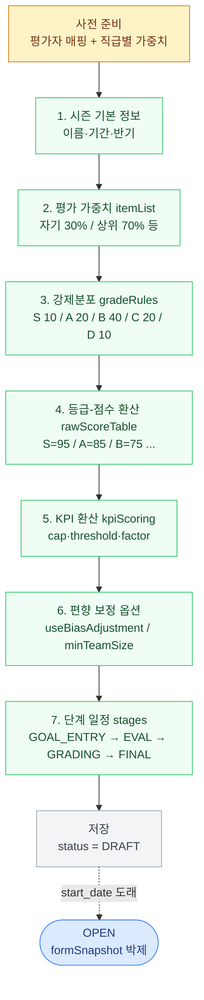

# 시즌 생성·설정 방법

HR 관리자(HR_ADMIN) 가 새 평가 시즌을 만들고 운영 옵션을 설정하는 전체 흐름.
각 단계마다 무엇을 설정하는지 + 어디 화면에서 + 어떤 주의가 있는지.



## 진입 경로

```
[성과평가] → [평가 설계] → [시즌 생성]
```

권한: HR_ADMIN 만.

## 사전 준비 (시즌 생성 전 반드시 확인)

### A. 평가자 사전 매핑 — 필수 사전 작업

`emp_evaluator_global` 테이블에 모든 ACTIVE 사원의 평가자가 매핑되어 있어야 함.

**확인·설정 위치**: [평가 설계] → [평가자 관리] → [사원·평가자 매핑]

**누락 사원 있으면**:
```
ERROR: 평가자 매핑 미지정 사원 N명 — /eval-admin?tab=emp-evaluator 에서 지정 필요
```
→ 시즌 생성 단계에서 차단됨.

**일괄 자동 매핑** (부서장 룰):
1. [평가자 관리] → [일괄 자동 매핑] 버튼
2. 부서별 최고 직급 사원이 자동 평가자로 지정됨
3. 부서장 본인은 같은 부서 차순위 직급에 매핑
4. 본부장 (T-HEAD) · 대표는 매핑 X (피평가도 X)
5. 자동 매핑 후 수동으로 일부 조정 가능

### B. KPI 옵션 사전 등록 (선택)

회사가 KPI 카테고리·태그 등을 미리 정의하려면 [평가 설계] → [KPI 옵션] 에서 설정.
사원이 GOAL_ENTRY 단계에서 등록할 때 드롭다운으로 선택.

## 1단계 — 시즌 기본 정보

| 항목 | 설명 | 예시 |
|------|------|------|
| 시즌명 | 자유 입력 | "2025년 하반기 성과평가" |
| period | 시즌 유형 | FIRST_HALF / SECOND_HALF / ANNUAL |
| start_date | 시즌 시작일 (DRAFT → OPEN 전이일) | 2025-07-01 |
| end_date | 시즌 종료일 | 2025-12-31 |

⚠ **주의**:
- 같은 회사에서 OPEN 상태 시즌이 둘 이상 있으면 안 됨 (단일 OPEN 강제)
- start_date 가 지난 시즌도 DRAFT 로 등록은 가능 (시작일 도래 시 즉시 OPEN 전환)

## 2단계 — 단계(Stage) 일정

5단계 (또는 가변) 의 시작·종료 날짜 입력:

```
1. 목표등록 (GOAL_ENTRY)        — 시즌 초 1~2주
2. 자기평가 (EVALUATION)         — 시즌 말 1주
3. 상위자평가 (EVALUATION)       — 자기평가 후 1주
4. 등급산정 (GRADING)            — 자동 + 수동 보정
5. 결과확정 (FINALIZATION)       — 마지막
```

⚠ **주의**:
- 단계별 일정이 겹치면 안 됨 (백엔드 가드)
- 단계 순서는 고정 (재배열 X)
- GRADING 단계 진입 시 자동 산정 3종이 즉시 호출됨 — 그 전에 상위자평가 모두 완료 필수
- start_date / end_date 는 시즌 OPEN 후에도 수정 가능 (단계만)

## 3단계 — form 규칙 설정

### 3-1. itemList — 평가 항목 가중치
```json
[
  {"id":"self","name":"자기평가","weight":30,"locked":true,"enabled":true},
  {"id":"manager","name":"상위자평가","weight":70,"locked":true,"enabled":true}
]
```
- **가중치 합 = 100** (검증 강제)
- `locked: true` 로 설정하면 시즌 진행 중 변경 X
- `enabled: false` 로 항목 비활성화 가능 (예: 자기평가 안 쓰는 회사)

⚠ 시즌 OPEN 후 변경 X — 다음 시즌부터.

### 3-2. gradeRules — 강제분포 비율
```json
[
  {"id":"S","label":"S","ratio":10},
  {"id":"A","label":"A","ratio":20},
  {"id":"B","label":"B","ratio":40},
  {"id":"C","label":"C","ratio":20},
  {"id":"D","label":"D","ratio":10}
]
```
- **ratio 합 = 100** (검증 강제)
- 회사별 자유 조정 (보수적이면 S=5, 후하면 S=15 등)

⚠ 등급 ID(S/A/B/C/D) 추가·삭제는 권장 X — rawScoreTable 과 화면이 모두 연동됨.

### 3-3. rawScoreTable — 등급 → 원점수
```json
[
  {"gradeId":"S","rawScore":95},
  {"gradeId":"A","rawScore":85},
  {"gradeId":"B","rawScore":75},
  {"gradeId":"C","rawScore":65},
  {"gradeId":"D","rawScore":50}
]
```
- 팀장이 부여한 등급을 점수로 환산할 때 사용
- gradeRules 의 등급 ID 와 일치해야 함

⚠ rawScore 값을 박하게 (예: S=90, A=80) 바꾸면 manager_score 분포가 박해지지만, 결국 강제분포로 비율은 같음.

### 3-4. kpiScoring — KPI 달성률 환산 규칙
```json
{
  "cap": 120,
  "scaleTo": 100,
  "maintainTolerance": 0,
  "underperformanceThreshold": 0,
  "underperformanceFactor": 1.0
}
```

| 옵션 | 의미 |
|------|------|
| `cap` | 달성률 상한 (%). 120% 면 130% 입력해도 120 으로 절단 |
| `scaleTo` | 정규화 점수 (보통 100) |
| `maintainTolerance` | MAINTAIN(유지) 방향 KPI 의 허용 오차 |
| `underperformanceThreshold` | 미달 패널티 발동 임계 |
| `underperformanceFactor` | 미달 시 점수 배율 (0.5 면 절반) |

⚠ cap 누락하면 raw_self_score 가 100 초과 가능 → calibration 화면에 "이상값" 으로 표시.

### 3-5. 편향 보정 옵션
```json
{
  "useBiasAdjustment": true,
  "biasWeight": 1.00,
  "minTeamSize": 5
}
```

| 옵션 | 의미 | 권장 |
|------|------|------|
| `useBiasAdjustment` | Z-score 보정 사용 | true (회사 정책) |
| `biasWeight` | 보정 강도 (0~1.5 권장) | 1.00 |
| `minTeamSize` | 보정 적용 최소 팀 인원 | 5 |

⚠ minTeamSize 미만 팀은 보정 스킵 → calibration 화면 "이상 팀" 으로 표시. HR 검토 권장.

## 4단계 — 시즌 등록 → DRAFT 저장

저장 시 `status = DRAFT`. DRAFT 상태에서:
- ✓ 기본정보 (시즌명·기간) 자유 수정
- ✓ 단계 일정 자유 수정
- ✓ formSnapshot 옵션 (gradeRules 등) 자유 수정 (아직 박제 X)
- ✓ 시즌 삭제 가능

## 5단계 — OPEN 전환

### 자동 전환 (권장)
SeasonScheduler 가 매일 자정에 실행:
- Season.start_date == 오늘 → DRAFT → OPEN 자동 전환

### 수동 전환
[성과평가] → [시즌 관리] → "시즌 시작" 버튼 (HR_ADMIN)

### OPEN 전환 시 자동 처리
1. **formSnapshot 박제** — 위 5가지 규칙 (itemList / gradeRules / rawScoreTable / kpiScoring / 편향보정 옵션) 모두 박제. 이후 변경 X.
2. **EvalGrade 행 박제** — 그 시점 ACTIVE 사원 × 시즌 별로 행 생성:
   - `evaluator_id_snapshot` 에 평가자 매핑 복사
   - `dept_id_snapshot`, `position_snapshot` 도 박제
   - 시즌 도중 부서·직급 변경되어도 박제값 기준으로 평가 진행

## 변경 가능·불가능 정리

| 항목 | DRAFT | OPEN | CLOSED |
|------|-------|------|--------|
| 기본정보 (시즌명·기간) | ✓ | ✓ | ✗ |
| 단계 일정 | ✓ | ✓ | ✗ |
| formSnapshot (모든 규칙) | ✓ (저장만) | ✗ (박제) | ✗ (박제) |
| 평가자 매핑 (글로벌) | ✓ | ✗ (시즌 종료 후) | ✗ |
| EvalGrade 평가자 (시즌별) | ✗ (생성 안 됨) | (수동 가능) | ✗ |
| 시즌 삭제 | ✓ | ✗ | ✗ |

## 다음 시즌 적용

규칙 변경하려면:
1. 다음 시즌 생성 시 새 규칙 입력
2. 그 시즌부터 적용
3. 기존 시즌은 기존 규칙 유지

## Step-by-step 체크리스트

```
□ A. 모든 ACTIVE 사원 평가자 매핑 완료 ([평가자 관리])
□ B. KPI 옵션 등록 (필요 시)
□ 1. 시즌 기본 정보 입력 (이름·기간)
□ 2. 단계 일정 입력 (5단계, 겹치지 않게)
□ 3-1. itemList 가중치 (자기 30 / 상위 70 또는 회사 정책)
□ 3-2. gradeRules 비율 (S 10 / A 20 / B 40 / C 20 / D 10 또는 정책)
□ 3-3. rawScoreTable 등급→점수
□ 3-4. kpiScoring 옵션 (cap, threshold)
□ 3-5. 편향 보정 옵션 (useBiasAdjustment, biasWeight, minTeamSize)
□ 4. DRAFT 저장 (검증 통과 확인)
□ 5. start_date 도래 → 자동 OPEN (또는 수동)
□ 6. EvalGrade 박제 결과 확인 (대시보드 또는 시즌 상세)
```

## 흔한 시나리오

| 상황 | 처리 |
|-----|------|
| 시즌 생성 시 "평가자 미지정 N명" 차단 | [평가자 관리] 에서 매핑 후 재시도 |
| OPEN 후 신규 입사자 | 평가자 자동 매핑 X → HR 알림 + 수동 매핑 |
| OPEN 후 규칙 변경 필요 | 그 시즌은 변경 X. 다음 시즌 등록 시 |
| 시즌 시작일 잘못 입력 | DRAFT 상태에서 수정. OPEN 후엔 단계 일정만 |
| 시즌 삭제 필요 | DRAFT 상태에서만 가능 |
