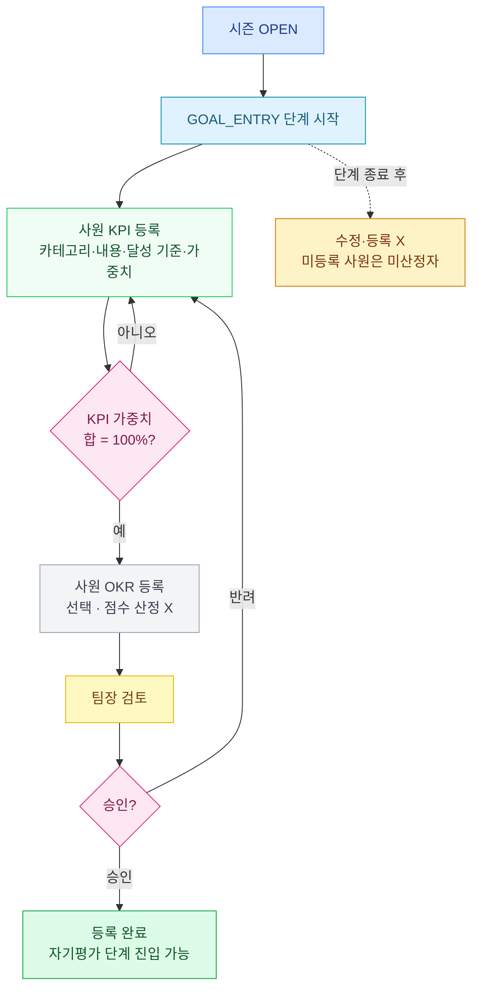

# KPI / OKR 목표 관리



## KPI vs OKR

| | KPI | OKR |
|---|---|---|
| 의미 | 정량 핵심 지표 | 자기개발 목표 |
| 가중치 | ✓ (합 100) | X |
| 점수 산정 | ✓ 자기평가 점수 계산 대상 | ✗ (산정 제외) |
| 사원당 개수 | 4~5개 | 1~3개 |
| 템플릿 | 부서·직급별 사전 정의 | 사원 직접 입력 |

→ **KPI 는 자기평가 점수 산정에 직접 영향, OKR 은 자기개발용 (점수 무관)**

## 목표등록 단계 (GOAL_ENTRY) — 사원 동작

### 진입
```
[성과평가] → [성과관리(개인)] → [목표등록]
```

### 등록 가능 시기
- **GOAL_ENTRY 단계 IN_PROGRESS 일 때만**
- 시작 전 (WAITING) 또는 종료 후 (FINISHED) 는 등록·수정 불가

### KPI 등록
1. 부서·직급 매칭 KPI 템플릿 선택 (드롭다운)
2. 목표값 (target_value) 입력
3. 가중치 (%) 입력 — KPI 들의 합 100
4. "일괄 제출" → 상태 PENDING (팀장 승인 대기)

### OKR 등록
1. 카테고리 선택 (업무성과/프로젝트/고객만족/품질/효율성)
2. 제목 + 설명 입력
3. 가중치 X
4. 제출 → PENDING

### 단계 종료 후 변경 불가
- GOAL_ENTRY 단계 FINISHED 되면 목표 추가·수정·삭제 X
- 승인 (PENDING → APPROVED) 도 GOAL_ENTRY 단계 안에서 처리

## 목표 승인 (팀장)

### 진입
```
[성과평가] → [성과관리(팀장)] → [목표승인]
```

### 동작
- 팀원 목표 목록 조회 (PENDING 만)
- 개별 또는 일괄 승인/반려
- 승인 → APPROVED (자기평가 단계에서 점수 입력 가능)
- 반려 → REJECTED (사원이 단계 기간 내 수정 후 재제출)

### 주의
- 단계 기간 내 처리 못 하면 PENDING 상태로 다음 단계 진행 시 불이익
- 승인 안 된 KPI 는 자기평가 점수 산정에서 제외됨

## 자기평가 단계 (EVALUATION — self) — 사원

### 등록 가능 시기
- **자기평가 EVALUATION 단계 IN_PROGRESS 일 때만**

### 동작
1. 승인된 KPI 만 표시 (OKR 자동 제외)
2. 각 KPI 별 달성치 (actual_value) 입력
3. 자기평가 코멘트 (선택)
4. 제출 → PENDING (팀장 검토 대기)
5. 팀장 반려 시 단계 기간 내 수정 후 재제출 가능

### 점수 계산 (자동)
- 각 KPI 달성률 = `computeAchievementRate(direction, target, actual)`
  - UP: actual / target
  - DOWN: target / actual (낮을수록 좋음)
  - MAINTAIN: tolerance 범위 내면 100%, 초과면 선형 감점
- 가중평균 → `self_score` (만점 100)
- 100 초과 시 `raw_self_score` 에 원점수, `self_score` 는 100 으로 clip

## 상위자평가 단계 (EVALUATION — manager) — 팀장

### 등록 가능 시기
- **상위자평가 EVALUATION 단계 IN_PROGRESS 일 때만**

### 동작
1. [성과관리(팀장)] → [팀원평가]
2. 팀원별 등급 부여 (S/A/B/C/D)
3. 코멘트 + 피드백 (선택)
4. 제출 → `manager_evaluation.grade_label` 저장

### 단계 종료 후
- **이 단계 끝나면 사원 화면에 등급 노출 시작**
- 이후 GRADING 단계로 전환

## 단계별 가능 작업 정리

| 작업 | GOAL_ENTRY | EVAL(self) | EVAL(manager) | GRADING | FINALIZATION |
|------|----|----|----|----|----|
| KPI/OKR 등록·수정 | ✓ | ✗ | ✗ | ✗ | ✗ |
| 목표 승인 | ✓ | ✗ | ✗ | ✗ | ✗ |
| 자기평가 입력 | ✗ | ✓ | ✗ | ✗ | ✗ |
| 자기평가 승인/반려 | ✗ | ✓ | ✗ | ✗ | ✗ |
| 상위자평가 입력 | ✗ | ✗ | ✓ | ✗ | ✗ |
| 등급 산정 (자동) | ✗ | ✗ | ✗ | ✓ | ✓ |
| 등급 보정 (수동) | ✗ | ✗ | ✗ | ✓ | ✓ |
| 최종 확정 | ✗ | ✗ | ✗ | ✗ | ✓ |

## 흔한 실수

| 상황 | 결과 |
|-----|------|
| GOAL_ENTRY 종료 후 목표 등록 시도 | 거부 — 단계 잠금 |
| KPI 가중치 합 ≠ 100 | 백엔드 검증 실패 |
| 자기평가 단계인데 OKR 만 입력 | 점수 산정 X (KPI 만 대상) |
| 자기평가 점수 100 초과 | raw_self_score 에 기록, self_score 는 clip → calibration 에서 검토 대상 |
| 팀장이 단계 기간 내 승인 안 함 | PENDING 상태 → 점수 산정 제외 → autoGrade 도출 X → 미산정자로 분류 |
