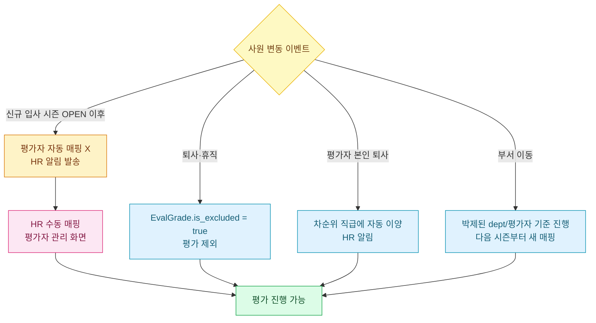

# 평가자 매핑 + 사원 변경 처리



## 평가자 매핑 — 두 단계

### 1. 글로벌 매핑 (`emp_evaluator_global`)
- 사원 ↔ 평가자 (보통 부서장) 1:1 매핑
- HR 이 [평가자 관리] 화면에서 관리
- **시즌 등록 전 모든 ACTIVE 사원이 매핑되어 있어야 함**

### 2. 시즌 박제 (`eval_grade.evaluator_id_snapshot`)
- 시즌 OPEN 시점의 글로벌 매핑이 EvalGrade 행에 박제
- 시즌 도중 매핑 변경해도 박제값은 유지

## 매핑 가드 (시즌 등록 시)

```
DRAFT 시즌 생성 시:
  ├─ 글로벌 매핑 안 된 사원 검사
  └─ 미매핑 사원 N명 → 시즌 생성 차단
       에러: "평가자 매핑 미지정 사원 N명 — /eval-admin?tab=emp-evaluator"
```

## 자동 매핑 룰

```
평가자 = 같은 부서의 최고 직급 사원 (= 부서장)

부서장 본인 → 같은 부서의 차순위 직급 사원
본부장 (T-HEAD = 임원) → 평가 제외 (is_excluded=true)
대표 → 자기평가만 (상위자 X)
```

## 부서 계층 검증

평가자 부서가 피평가자 부서와 같거나 **상위 부서**여야 유효.
- 같은 팀 ✓
- 본부 → 팀 (상위) ✓
- 형제·사촌 부서 ✗ (무효 매핑 차단)

## 시즌 OPEN 후 — 신규 입사자 처리

### 시나리오
- DRAFT 시점 ACTIVE 사원만 EvalGrade 박제됨
- DRAFT → OPEN 사이 또는 OPEN 후 신규 입사한 사원은 **EvalGrade 행 자동 생성 X**
- → 그 사원은 이번 시즌 평가 대상 제외

### 알림 동작 (추정)
- 신규 입사자 발견 → HR 에 알림 (다음 시즌 평가 대상 등록 권고)
- 시즌 도중 평가 대상 추가는 수동 EvalGrade 행 INSERT 필요

## 사원 퇴사 처리 — `EvaluatorRetirementHandler`

### 트리거
사원 퇴사 → `EmployeeRetiredEvent` 발행 → `EvaluatorRetirementListener` 가 AFTER_COMMIT 으로 수신

### 처리 (퇴사자가 평가자였던 경우)

1. **글로벌 매핑 정리**:
   - `emp_evaluator_global` 에서 그 사원이 evaluator 인 row 삭제
   - 피평가자들 다음 시즌 매핑 미지정 상태로 복귀

2. **진행 중 시즌 EvalGrade 정리**:
   - `evaluator_id_snapshot = 퇴사자 emp_id` 인 행 → null 처리
   - 새 평가자 미지정 상태로 풀림

3. **HR 알림 발송**:
   - 제목: "평가자 지정 필요"
   - 내용: "퇴사자로 인해 평가자가 지정되지 않은 사원 N명"
   - 링크: `/eval-admin?tab=emp-evaluator`
   - 대상: HR_ADMIN, HR_SUPER_ADMIN

### HR 후속 조치
1. 알림 클릭 → 평가자 관리 화면
2. 미지정 사원 확인
3. 새 평가자 수동 매핑 (글로벌 + EvalGrade 둘 다)

## 사원 퇴사 (피평가자) 처리

진행 중 시즌에 피평가자가 퇴사 → 처리:
- EvalGrade 행은 그대로 유지 (이미 박제됨)
- 평가 진행 가능 — 점수·등급 산정 대상
- 단, 퇴사일 이후 자기평가 입력 X (사원 본인 접근 불가)
- HR 가 미산정자로 분류해서 처리 결정

## 휴직자 처리 (추정)

- `emp_status = 'ON_LEAVE'` 사원은 자동으로 평가 대상 제외 추정
- 명시적 가드 코드 미확인 — 부서장이 수동으로 `is_excluded=true` 설정 필요할 수 있음

## 부서 이동 (Transfer)

### 시즌 도중 부서 이동
- EvalGrade 의 `dept_id_snapshot` 은 시즌 OPEN 시점의 부서 (변경 X)
- 평가자 (`evaluator_id_snapshot`) 도 이동 전 부서장 그대로
- 결과: **이동 전 부서장이 평가 진행**

### 다음 시즌 등록 시
- 새 시즌 OPEN 시점에 새 부서장으로 자동 매핑

## 평가자 글로벌 매핑 변경 — 진행 중 시즌 가드

```
EmpEvaluatorService.updateGlobal():
  └─ 진행 중 (status=OPEN) 시즌 있으면 → 변경 차단
     "진행 중 시즌이 있어 글로벌 매핑을 변경할 수 없습니다.
      시즌 종료 후 작업하세요."
```

→ 진행 중 시즌의 박제값과 새 매핑이 충돌할 수 있어 차단.
시즌 종료 후 (CLOSED) 다음 시즌 위해 매핑 정리.

## EvalGrade 평가자만 변경 (예외 처리)

진행 중 시즌에서 특정 사원의 평가자만 바꿔야 하면:
- HR 이 EvalGrade 행의 `evaluator_id_snapshot` 직접 수정 (별도 API 또는 DB 조작)
- 글로벌 매핑은 건드리지 않음

## 흔한 시나리오 정리

| 상황 | 처리 |
|-----|------|
| 시즌 등록 전 신규 입사 | 자동 매핑 후 시즌 등록 |
| 시즌 OPEN 후 신규 입사 | 이번 시즌 제외, 다음 시즌부터 |
| 평가자 퇴사 | RetirementHandler 자동 처리 + HR 알림 |
| 피평가자 퇴사 | EvalGrade 유지, 미산정자로 분류 가능 |
| 부서 이동 (도중) | 이동 전 부서장이 평가 |
| 부서장 변경 (인사발령) | 자동 매핑 즉시 반영 (단, 진행 중 시즌은 박제값 유지) |
| 휴직 | 평가 대상 제외 (확인 필요) |

## 화면 동선 — 평가자 관리

### 진입 경로
```
[성과평가] → [평가자 관리]   (URL: /eval-admin?tab=emp-evaluator)
```
권한: `HR_ADMIN`, `HR_SUPER_ADMIN`

### 화면 구성 — 3개 탭

| 탭 | 용도 |
|----|------|
| **사원-평가자 매핑** (기본) | 사원 ↔ 평가자 1:1 글로벌 매핑 관리 |
| **부서 계층** | 부서 ↔ 상위부서 관계 확인 (매핑 유효성 검증 기준) |
| **이력** | 매핑 변경 이력 조회 (감사 용도) |

### 일괄 자동 매핑 사용법

**언제 사용**: 시즌 처음 등록 전 / 신규 입사자 다수 / 부서 개편 후

**단계**:
1. [평가자 관리] → [사원-평가자 매핑] 탭
2. 상단의 [일괄 자동 매핑] 버튼 클릭
3. 다이얼로그 — 적용 범위 선택:
   - **전체** — 미매핑 사원 + 매핑된 사원 모두 (덮어쓰기)
   - **미매핑만** — 평가자 비어있는 사원만 (권장)
4. [실행] 클릭 → 자동 매핑 룰 적용
   - 평가자 = 같은 부서의 최고 직급 사원 (= 부서장)
   - 부서장 본인은 같은 부서 차순위 직급
5. 결과 화면: 매핑된 N명, 매핑 실패 M명 (수동 조정 필요)

### 수동 조정 사용법

**언제 사용**: 자동 매핑 룰로 안 잡히는 예외 케이스 (매트릭스 조직, 프로젝트 PM 평가 등)

**단계**:
1. [사원-평가자 매핑] 탭의 사원 목록에서 대상 사원 행 클릭
2. 우측 패널에서 [평가자 변경] 버튼
3. 평가자 후보 검색창 — 이름·사번으로 검색
4. 후보 선택 → 부서 계층 검증 통과해야 저장 가능 (같은 부서 또는 상위 부서)
5. [저장] → `emp_evaluator_global` 즉시 갱신 + 이력 기록

### 평가 제외 처리

특정 사원을 평가 대상에서 빼야 할 때:
1. 사원 행 → [평가 제외] 토글 ON
2. `is_excluded = true` 저장
3. 다음 시즌 OPEN 시 EvalGrade 행 생성 안 됨

## 주의 사항

> ⚠ **시즌 OPEN 후엔 글로벌 매핑 변경 차단**
> 진행 중 시즌이 있으면 `EmpEvaluatorService.updateGlobal()` 가 차단. 시즌 CLOSED 후에만 변경 가능.
> 진행 중 시즌의 특정 사원 평가자만 바꿔야 하면 EvalGrade 의 `evaluator_id_snapshot` 만 직접 수정 (별도 API).

> ⚠ **시즌 OPEN 후 신규 입사자는 이번 시즌 자동 제외**
> EvalGrade 행이 시즌 OPEN 시점에 박제되므로 이후 입사자는 박제 안 됨.
> 다음 시즌부터 평가 대상. 이번 시즌에 굳이 포함하려면 EvalGrade 행 수동 INSERT 필요 (비표준).

> ⚠ **부서 이동 시 박제값 우선**
> 시즌 도중 부서 이동해도 `dept_id_snapshot`·`evaluator_id_snapshot` 은 OPEN 시점 값 유지.
> "이동 전 부서장이 평가" 가 정상. 사원이 이상하게 느껴질 수 있어 인사 측에 사전 안내 권장.

> ⚠ **부서 계층 외 매핑은 무효**
> 평가자 부서가 피평가자 부서와 같거나 상위 부서여야 저장 가능.
> "형제·사촌 부서 사원이 평가" 시도는 백엔드가 차단.

> ⚠ **휴직자 처리는 명시적 코드 미확인**
> `emp_status='ON_LEAVE'` 자동 제외 추정이지만 가드 코드 미확인. 시즌 시작 전 HR 가 휴직자 `is_excluded=true` 명시 권장.

> ⚠ **평가자 퇴사 후 미지정 상태 방치 X**
> RetirementHandler 가 자동으로 null 처리 + 알림. HR 알림 클릭해서 새 평가자 즉시 매핑. 방치 시 그 사원 미산정자.

> ⚠ **자동 매핑 [전체] 모드는 매핑 덮어씀**
> 수동 조정한 매핑까지 룰로 덮어쓰니 주의. 보통은 [미매핑만] 모드.

## FAQ

**Q: 시즌 등록하려는데 "평가자 매핑 미지정 사원 N명" 오류가 떠요.**
A: DRAFT 시즌 생성 단계의 가드 — 모든 ACTIVE 사원이 `emp_evaluator_global` 에 매핑되어 있어야 함.
오류 메시지의 링크 (`/eval-admin?tab=emp-evaluator`) 클릭 → [일괄 자동 매핑] (미매핑만 모드) → 매핑 실패한 잔여 사원만 수동 조정 → 시즌 생성 재시도.

**Q: 평가자가 본인 자기 자신을 평가하는 케이스가 있나요?**
A: 룰상 없음. 부서장 본인은 같은 부서 차순위 직급이 평가. 만약 차순위 직급이 없는 1인 부서면 자동 매핑 실패 → HR 가 상위 부서 사원 (본부장 등) 으로 수동 매핑.

**Q: 시즌 도중에 사원이 부서 이동했어요. 새 부서장이 평가하나요?**
A: 아니요. **이동 전 부서장**이 평가 (박제값 우선). 새 부서장은 다음 시즌부터.

**Q: 평가자가 갑자기 퇴사하면 그 사원들 어떻게 되나요?**
A: 자동으로 `EvaluatorRetirementHandler` 가 처리:
1. `emp_evaluator_global` 에서 퇴사자 row 삭제
2. 진행 중 시즌의 `evaluator_id_snapshot = 퇴사자` 인 행 → null
3. HR_ADMIN 들에게 알림 발송 ("평가자 지정 필요 N명")
HR 가 알림 클릭 → 새 평가자 수동 매핑 → 평가 재개.

**Q: 시즌 진행 중에 글로벌 매핑 바꾸려는데 차단돼요.**
A: 정상. 진행 중 시즌과 박제값 충돌 방지를 위한 가드. 두 가지 옵션:
- **시즌 끝나기 기다림** → CLOSED 후 변경 → 다음 시즌부터 적용
- **이번 시즌만 임시 변경** → EvalGrade 의 `evaluator_id_snapshot` 만 직접 수정 (글로벌은 그대로)

**Q: 매트릭스 조직이라 부서장 외에 PM 도 평가에 참여시키고 싶어요.**
A: 현재 시스템은 1:1 평가자만 지원 (피평가자 1명당 평가자 1명). PM 평가 같은 다대일 평가는 별도 워크플로우 필요. 차선책: PM 을 부서장으로 등록하거나, 평가자를 PM 으로 수동 지정.

## 회사 정책별 변형 패턴

표준 룰 외에 회사 정책에 따라 변형 가능. 지원 여부는 시스템 옵션이 아니라 HR 가 글로벌 매핑을 어떻게 설정하는지로 결정.

| 회사 유형 | 매핑 방식 |
|---------|-----------|
| **표준 (위계 조직)** | 자동 매핑 룰 그대로 — 부서장이 부서원 평가 |
| **소규모 회사 (전체 < 30명)** | 자동 매핑 후 수동 조정 다수 — 부서 인원 적어 룰이 잘 안 잡힘 |
| **매트릭스 조직** | 자동 매핑 X, 전부 수동 — 사업부·기능부 양쪽 평가하려면 별도 워크플로우 필요 (현재 시스템 단순 지원) |
| **PM 평가 병행** | 1:1 룰 한계로 PM 을 평가자로 등록하는 방식 회피책 사용 |
| **임원 360도** | 본부장(T-HEAD) 은 평가 대상 제외이므로 시스템 외부 별도 평가 |
| **신생 부서** | 부서장 미지정 시 자동 매핑 실패 → 임시로 상위 부서장 매핑 |

## 분석 영향

- **#5 평가자 점수 분포**: 부서장 본인 = 평가자 풀 = 보통 부서 수만큼 (소규모 회사면 5~10명만). 평가자 풀이 작으면 Z-score 통계 의미 약함.
- **#1 부당 보상 후보**: 평가자 매핑 누락 사원은 자기평가만 있고 manager_score = null → 미산정자로 분석에서 자연 제외.
