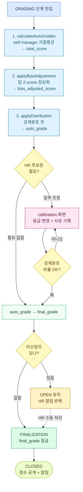

# 등급 산정·후보정·최종 확정

GRADING + FINALIZATION 단계의 HR 운영 가이드.



## GRADING 단계 — 자동 산정 3종

GRADING 단계 진입 시 SeasonScheduler / SeasonTransitionExecutor 가 자동 호출.
HR 이 [등급산정·보정] 화면에서 수동으로 다시 트리거 가능.

### 1. calculateAutoGrades() — 종합 점수 산정

```
total_score = (self_score × self_weight + manager_score × manager_weight)
             / (self_weight + manager_weight)

(가중치는 formSnapshot.itemList 기준 — 보통 self 30 / manager 70)
```

- 자기평가 (KPI 만, OKR 제외) 가중평균 → `self_score` (만점 100, 초과 시 raw 보존)
- 상위자평가 등급 → `manager_score` (rawScoreTable 환산)
- `total_score`, `weighted_score` 컬럼 저장

### 2. applyBiasAdjustment() — Z-score 편향 보정

목적: 후한·박한 평가자 편향 정상화

```
팀별로:
  Z = (manager_score - 팀평균) / 팀표편차
  manager_score_adjusted = 전사평균 + Z × 전사표편차

총점 재계산:
  total_score = (self × self_w + adjusted_mgr × mgr_w) / (self_w + mgr_w)
  → bias_adjusted_score
```

### 보정 스킵 조건 (주의 — 분석 정확도 영향)

| 조건 | 처리 |
|------|------|
| 팀 인원 < `min_team_size` (기본 5) | 보정 스킵, 원점수 유지 |
| 팀 표편차 = 0 (전원 동점) | 보정 불가, 원점수 유지 |
| `use_bias_adjustment = false` | 보정 자체 스킵 |
| `manager_score = null` | 평가 미입력자 — 보정 대상 X |

→ 위 케이스는 calibration 화면의 "이상 팀" 으로 표시됨. HR 이 수동 검토 필요.

### 3. applyDistribution() — 강제분포 적용

```
1. bias_adjusted_score 내림차순 정렬 (동점 시 weighted_score)
2. gradeRules 비율대로 컷:
   - 상위 10% → S
   - 그 다음 20% → A
   - ...
3. 마지막 등급은 잔여 인원 (정합성)
4. 컷 점수 동점자는 상위 등급 흡수 (미세 비율 초과 허용)
5. → auto_grade 컬럼
```

### confirm 메커니즘
- cohort 변경 (점수 산정 사원 수 변화) + 이전 보정 이력 있으면 → `requiresConfirm=true`
- HR 이 "재배분 확정" 클릭하면 보정 이력 삭제 + 재배분
- 변경 없으면 no-op (이미 적용된 분포 유지)

## 후보정 (Calibration) — HR 수동

### 진입
```
[성과평가] → [등급산정·보정] → [등급보정]
```

### 보정 검토 화면 (`getCalibrationReview()`)

표시:
- **이상 팀**: Z-score 보정 스킵된 팀 (소규모 / 전원 동점)
- **clip 대상**: `raw_self_score > 100` 사원 (자기평가 만점 초과)
- **현재 등급 분포** vs **목표 분포**

### 보정 동작

1. 사원별 fromGrade → toGrade + reason 입력
2. "일괄 저장" 클릭
3. 백엔드 검증:
   - 보정 후 등급 비율이 회사 `gradeRules` 와 일치하는지
   - 불일치 시 400 반환, DB 변경 X
4. 통과 시:
   - `calibration` 테이블 INSERT (fromGrade, toGrade, reason, actor)
   - `eval_grade.final_grade` 업데이트
   - `is_calibrated = true`

### 보정 안 하면
- `auto_grade` 가 그대로 `final_grade` 에 복사됨 (확정 단계에서)
- HR 가 보정 단계 스킵해도 자동 진행

## 이의신청 받는 기간

별도 이의신청 시스템 X. 단, 후보정 단계 = **상위자평가 종료 후라 사원에게 등급 노출됨**.

```
사원: 본인 등급 확인 → 팀장·HR 에 직접 의견 제기 (메신저·메일·면담)
HR: 후보정 회의에서 검토
  ├─ 인정 → 수동 보정 (calibration)
  └─ 기각 → autoGrade 그대로 final
```

→ "이의신청 받는 기간" = **GRADING 단계 IN_PROGRESS 기간**.

## 최종 확정 (FINALIZATION 단계)

### 진입
```
[성과평가] → [등급산정·보정] → [최종확정]
```

### 표시 정보
- 산정 완료 인원
- **미산정자** 명단 (auto_grade 가 null 인 사원)
- 보정 인원

### 미산정자 사유 (예시)
- 자기평가 미제출
- 상위자평가 미제출
- 시즌 도중 신규·복귀로 EvalGrade 행 없음
- 평가자 퇴사 후 미배정

### HR 동작
1. 미산정자 모두 처리 (수동 등급 부여 또는 분석 제외 ack)
2. "최종 확정" 버튼 클릭
3. `EvalGradeService.finalize()` 호출:
   - `final_grade` 잠금 (`locked_at` 기록)
   - `season.finalizedAt` 기록
   - `season.status = CLOSED`
4. **사원 알림 발송** (점수 공개)

### 자동 확정
- 시즌 `end_date` 경과 + 미산정자 0명 → SeasonScheduler 가 자동 finalize
- 미산정자 있으면 자동 X, HR 알림만 발송 후 OPEN 유지

## 권한

| 작업 | 권한 |
|------|------|
| 자동 산정 트리거 | HR_ADMIN |
| 보정 저장 | HR_ADMIN |
| 최종 확정 | HR_ADMIN |
| 결과 조회 (전사) | HR_ADMIN |
| 본인 결과 조회 | 사원 본인 |
| 팀 결과 조회 | 팀장 |

## 흔한 시나리오

| 상황 | 처리 |
|-----|------|
| 자동 산정 후 점수 이상 발견 | 보정 화면에서 수동 조정 |
| 강제분포 비율 어겼는데 보정 저장 시도 | 검증 실패 → 400 → DB 미변경 |
| 미산정자 처리 못 한 채 시즌 종료일 경과 | 자동 확정 X, OPEN 유지 + HR 알림 반복 |
| 확정 후 등급 변경 필요 | 시즌 CLOSED 면 변경 X — 다음 시즌 보정으로 반영 |
| 보정 후 cohort 변경 (사원 추가/제외) | 재배분 시 confirm 필요 → 보정 이력 삭제 + 재시작 |
