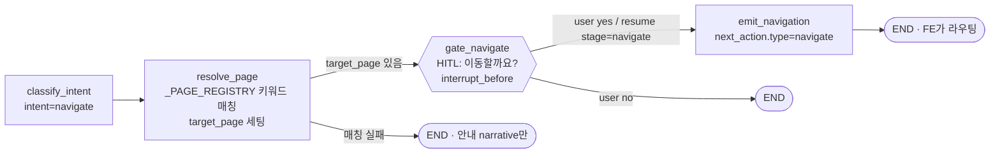

# 성과분석 라우팅 (navigate intent)

> 분석 서비스의 의도 분류에 `navigate` 분기를 추가해, "성과평가 어디서 해?", "분석 결과 보려면?", "z-score 어떻게 조정?" 같은 **페이지 안내성 발화**를 처리하도록 확장. 분석 결과가 아닌 **화면 이동**이 목적이다.
>
> 수정 파일: `analysis-service/analysis/graph.py` · 관련 상위 문서: [성과분석 AI (Analyze)](ai-analyze.md)

## 1. 작업 요약

| 항목 | 변경 전 | 변경 후 |
|------|---------|---------|
| 의도 | `analyze` / `explain` / `unknown` | `analyze` / `explain` / **`navigate`** / `unknown` |
| HITL 게이트 | `gate_generate`·`gate_save`·`gate_detail` (3개) | + **`gate_navigate`** (4개) |
| resume stage | `generate` / `save` / `detail` | + **`navigate`** |
| 응답 next_action | `hitl` 만 | + **`navigate`** (url·label·hint) |
| State 필드 | — | + `target_page`, `user_decision_navigate` |

**새로 추가된 노드**
- `resolve_page` — 발화 키워드 매칭으로 target 페이지 식별 + 안내 narrative 생성
- `gate_navigate` — HITL 마커(`interrupt_before`). FE에 "X 페이지로 이동할까요?" 노출
- `emit_navigation` — yes 결정 시 `next_action = {type:navigate, url, label, hint}` 부착

---

## 2. LangGraph navigate 분기



---

## 3. 의도 분류 룰 우선순위

`classify_intent`에서 룰을 **위에서 아래로** 평가, 매칭 즉시 confirm + return.

| # | 조건 | 결과 | 예시 |
|---|------|------|------|
| 1 | 강한 명령형 (보여줘 / 찾아 / 분석해 / 진단해 / 도출 / 발굴) | `analyze` | "우선인재 보상 누락 보여줘" |
| 2 | 의문문 + 설명 명사 (기준 / 정의 / 뜻 / 의미 / 설명) | `explain` | "보상 누락 기준이 뭐야" |
| 3 | **navigate 시그널 + 페이지 매칭** | `navigate` | "성과평가 어디서 해", "결과를 보려면", "z-score 어떻게 조정" |
| 4 | 도구 키워드 (워라밸 / 평가자 …) 또는 분석 키워드 | `analyze` | "워라밸 진단" |
| 5 | 일반 explain 키워드 또는 의문문 | `explain` | "Z-score가 뭔데" |
| 6 | 위 모두 미매칭 → LLM fallback (EXAONE) | 4지선다 분류 | 모호한 발화 |

**navigate 시그널 (룰 #3)** — 아래 중 하나 + `_PAGE_REGISTRY` 키워드 1개 이상 매칭:
- `"어디"` 포함, 또는
- 위치명사(메뉴 / 페이지 / 화면), 또는
- 어미 `~려면` / `~하려면`, 또는
- `어떻게` + 행동동사(조정 / 설정 / 진행 / 보기)

> **핵심 결정**: navigate가 "도구 키워드"(룰 #4)보다 **먼저** 체크된다. 안 그러면 "성과평가 어디서 해"가 평가자 분석(I-05)으로 빠질 수 있음.

---

## 4. 페이지 레지스트리 (`_PAGE_REGISTRY`)

한 곳에서 keyword → URL 관리. FE 라우트 바뀌면 여기만 손보면 됨.

| key | url | label | keywords (요약) | hint |
|-----|-----|-------|-----------------|------|
| `performance_evaluation` | `/eval` | 성과평가 | 성과평가, 고과, 평가 작성, 자기평가, 목표 등록 … | — |
| `ai_report` | `/hr/report` | AI 리포트 | AI 리포트, 분석 결과, 분석 보고서, 결과 확인/조회 … | — |
| `eval_admin_rules` | `/eval-admin` | 평가 관리 | 분석/평가 규칙, 임계값, 기준값, 등급 규칙, z-score … | '평가 규칙 관리' 탭에서 임계값·등급 규칙 조정 가능 |

**매칭 점수 규칙**
- 각 페이지 keywords 중 발화에 등장하는 개수 = 점수
- 최고 점수 페이지 1개 선택 (동점 시 dict 순서 첫 번째)
- 점수 0 → `target_page = None` → 안내 narrative만 남기고 END

---

## 5. API 응답 구조 (FE 연동) — 2단계 흐름

navigate는 **2단계**다: ① 첫 호출은 HITL 게이트(`hitl`/`ask_navigate`), ② 사용자가 yes resume하면 그때 `type: navigate` 발행.

**5-1. 첫 호출 "성과평가 어디서 해?"**
```json
{
  "intent": "navigate",
  "form": "short",
  "narrative": "성과평가 페이지에서 진행하실 수 있습니다.",
  "next_action": {
    "type": "hitl",
    "stage": "ask_navigate",
    "question": "성과평가 페이지로 이동할까요?",
    "options": ["yes", "no"]
  }
}
```
→ FE는 `next_action.type == "hitl"` 보고 yes/no 버튼 표시.

**5-2. yes 클릭 → `resume(stage="navigate", decision="yes")`**
```json
{
  "intent": "navigate",
  "narrative": "성과평가 페이지로 이동합니다.",
  "next_action": { "type": "navigate", "url": "/eval", "label": "성과평가" }
}
```
→ FE는 `next_action.type == "navigate"` 보면 `navigate(next_action.url)` 실행.

**5-3. hint가 있는 경우 (예: z-score 조정)**
```json
{
  "intent": "navigate",
  "narrative": "평가 관리 페이지로 이동합니다. '평가 규칙 관리' 탭에서 임계값·등급 규칙을 조정할 수 있습니다.",
  "next_action": {
    "type": "navigate", "url": "/eval-admin", "label": "평가 관리",
    "hint": "'평가 규칙 관리' 탭에서 임계값·등급 규칙을 조정할 수 있습니다."
  }
}
```
→ FE는 라우팅 후 `next_action.hint`를 toast/배너로 노출 가능.

**5-4. HITL stage 식별자**

| stage | 발생 분기 | 질문 | yes 시 동작 |
|-------|----------|------|-------------|
| `ask_generate` | analyze | "보고서 생성할까요?" | generate_doc |
| `ask_save` | analyze | "내 문서함에 저장할까요?" | save_to_inbox |
| `ask_detail` | explain | "더 자세히 설명할까요?" | generate_detailed_explain |
| **`ask_navigate`** | navigate | "{label} 페이지로 이동할까요?" | emit_navigation |

---

## 6. 트러블 슈팅 · 설계 결정

**6-1. navigate vs explain 충돌**
- 문제: "성과평가 어디서 해?"는 기존 룰에서 `어디서`+의문문 → explain으로 빠짐.
- 해결: navigate 룰을 explain 룰보다 **먼저** 체크. 단, 모든 의문문을 잡지 않게 **페이지 키워드 매칭이 동시 성립할 때만** True.

**6-2. navigate vs analyze 충돌**
- 문제: "성과평가 결과 보여줘"는 navigate? analyze?
- 해결: 룰 #1(강한 명령형 `보여줘`)이 최우선 → analyze. 반대로 "성과평가 결과 보려면"은 명령형 없고 `~려면` 매칭 → navigate.

**6-3. navigate 시그널 있는데 페이지 매칭 안 됨**
- 예: "분석을 잘하려면" → `~려면` 매칭, 페이지 키워드 매칭 ✗
- 해결: `_matches_navigate()`가 False 반환 → 다음 룰로 fall-through → explain(RAG가 답변).

**6-4. `/eval-admin` 탭 deep-link 안 됨**
- 문제: `EvalAdminPage`가 `useState`로 탭 관리 → URL로 `?tab=rules` deep-link 불가.
- 현재 대응: `_PAGE_REGISTRY.eval_admin_rules`에 `hint` 추가 → narrative와 `next_action.hint`로 "'평가 규칙 관리' 탭" 안내.
- 근본 해결(FE): `useSearchParams()`로 초기 탭 결정 → `/eval-admin?tab=rules` 직접 전달 가능.

**6-5. HITL 게이트 4개 동시 충돌 우려**
- 각 게이트는 서로 다른 분기(analyze/explain/navigate)에 위치 → 한 발화에서 동시 도달 없음. 단 4곳 모두 핸들 필요: ① `interrupt_before` 리스트 ② `resume_analysis(stage)` ③ `_build_api_response` 메타 빌드 ④ `route_by_intent`.

**6-6. CRAG 상태 리셋**
- `classify_intent`에서 매 턴 `crag_reset`(rewrite_count/grade 초기화) 적용. navigate 분기에서도 동일 적용 → 직전 explain 턴의 CRAG 상태가 전이되지 않게.

**6-7. PII 가드 무관**
- navigate 룰 매칭은 LLM 호출 없음(룰 매칭). fallback만 EXAONE 로컬 → 외부 egress 없어 PII 가드와 무관.

---

## 7. 남은 작업 / 후속 과제

**FE 측**
- **필수** — chat 응답 핸들러에서 `next_action.type == "navigate"` 케이스 처리, `useNavigate(next_action.url)` 이동.
- 선택 — `next_action.hint` 있으면 toast/배너 노출.
- 개선 — `EvalAdminPage`에 `useSearchParams()` 도입해 탭 deep-link 가능하게 → `_PAGE_REGISTRY` url을 `/eval-admin?tab=rules`로 교체하면 hint 불필요.

**분석 서비스 측 (확장 후보)**
- 다른 메뉴 매핑 추가 — `/salary`·`/payroll`·`/hr`·`/attendance`·`/approval`·`/calendar`·`/drive` 등 9개. "급여 어디서 봐" 같은 발화 필요 시 `_PAGE_REGISTRY` 항목 추가.
- `_PAGE_REGISTRY`를 별도 yaml/json으로 분리 (라우트 잦으면). 현재는 코드 내 dict로 충분.
- navigate 매칭 실패 로그 모니터링 → keywords 보강.

**테스트 권장**

| 발화 | 기대 |
|------|------|
| "성과평가 어디서 해?" | navigate / `/eval` |
| "분석 결과 보려면?" | navigate / `/hr/report` |
| "z-score 어떻게 조정?" | navigate / `/eval-admin` + hint |
| "성과평가 보여줘" | analyze (navigate 아님) |
| "성과평가 기준이 뭐야" | explain (navigate 아님) |
| "분석을 잘하려면" | explain (페이지 매칭 실패 → fall-through) |
