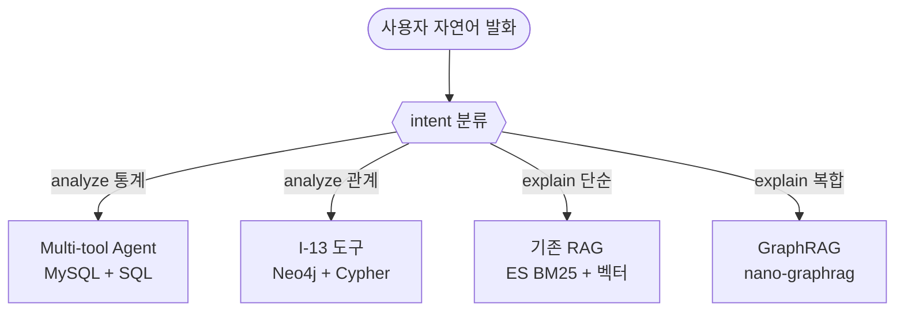
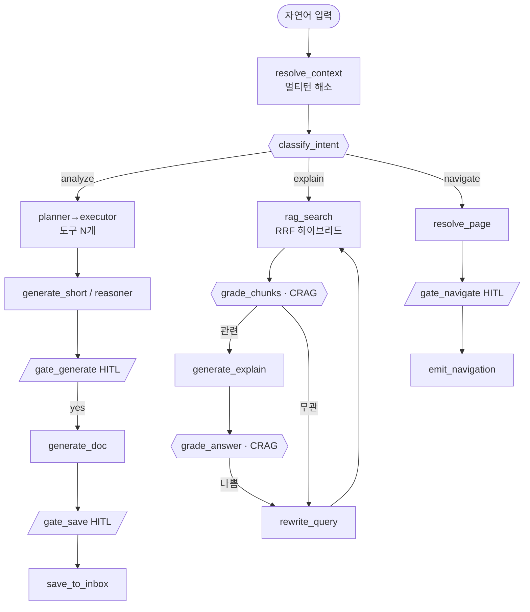
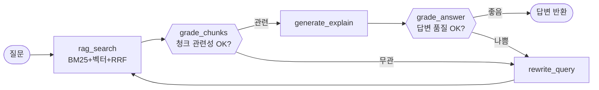
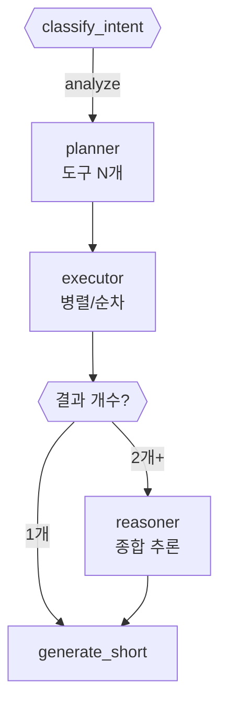

# 성과분석 AI (Analyze) — RAG + LangGraph 기반 자연어 HR 진단

> 사용자가 자연어로 HR 분석을 요청하면, RAG 기반 백엔드(FastAPI · LangGraph)가 부서·전사 단위 진단을 텍스트·차트·표로 반환한다. (개인 평가가 아닌 **조직 단위 진단**)

## 1. 개요

| 항목 | 값 |
|------|---|
| 진입점 | `POST /analyze` · `POST /analyze/resume` · `POST /analyze/stream` (SSE) |
| 백엔드 | `analysis-service/` — FastAPI · LangGraph · Python |
| FE | `src/pages/report/` · `src/contexts/AiReportContext.tsx` · `src/api/report.ts` |
| 모델 | 2개 (intent 분류 + 분석 생성) |
| 멀티턴 | `thread_id`로 같은 세션 내 후속 질문 누적 |
| RAG | 하이브리드(BM25 + 벡터) + RRF 융합 · Elasticsearch(Nori) · bge-m3 임베딩 |
| HITL | Human-in-the-Loop 2단계 (문서 생성 → 파일함 저장) |
| 관련 문서 | [라우팅 (navigate intent)](ai-analyze-routing.md) · [Elasticsearch Hybrid Search](elasticsearch.md) |

---

## 2. 4영역 분리 (Polyglot Persistence)

"분석"을 데이터 종류·질문 유형에 따라 4영역으로 나누고, 입구(intent 분류) 하나로 통합한다. 하나의 DB로 다 처리하면 어딘가 약해지므로 각 영역에 적합한 도구를 적용.



| 영역 | 처리 방식 | 데이터 | 예시 질문 |
|------|-----------|--------|-----------|
| ① DB 통계 분석 | Multi-tool Agent (SQL 집계) | MySQL 사원·평가·근태 | "워라밸과 보상 같이 봐줘" |
| ② DB 관계 탐색 | Neo4j + Cypher | MySQL → Neo4j 동기화 | "김철수의 평가자가 평가한 사원들" |
| ③ 문서 단순 검색 | Elasticsearch (BM25+벡터+RRF) | `rag/docs/` md 19개 | "Z-score가 뭐야?" |
| ④ 문서 복합 추론 | GraphRAG (nano-graphrag) | docs + 추출 엔티티/관계 | "Z-score와 백분위 차이?" |

---

## 3. LangGraph 상태머신

자연어 입력부터 최종 답변까지 노드 흐름을 따르며, HITL 4곳(`gate_generate`·`gate_save`·`gate_detail`·`gate_navigate`)에서 `interrupt_before`로 멈춰 FE 결정을 기다린다.



| intent | 주요 경로 | 특징 |
|--------|-----------|------|
| **analyze** | planner → executor → generate_short/reasoner → (HITL) 생성 → (HITL) 저장 | 도구 기반 분석 + HITL 2단계 |
| **explain** | rag_search → grade_chunks → generate_explain → grade_answer → (HITL) 상세 | CRAG 자기수정 루프 |
| **navigate** | resolve_page → (HITL) gate_navigate → emit_navigation | [라우팅 문서](ai-analyze-routing.md) 참조 |
| **fallback** | fallback → END | 모든 분기 실패 시 |

---

## 4. CRAG (Corrective RAG) 자기수정 루프

`explain` 분기는 단순 RAG가 아니라 **두 곳에서 LLM Judge가 품질을 평가**하는 자기수정 루프다.



- **리라이트 모델과 분석 생성 모델 분리** — 작은 모델이 쿼리만 재작성, 본 답변은 큰 모델.
- `MAX_REWRITES` 상한으로 무한 루프 방지.

---

## 5. RAG 하이브리드 검색 (BM25 + kNN + RRF)

`analysis/rag/search.py`. Elasticsearch 위에 한국어 BM25(Nori)와 벡터 kNN을 동시에 돌려 RRF로 합산한다.

```
쿼리 → ┌ BM25 (Nori, top 20)
       └ kNN 벡터 (bge-m3, top 20) → RRF 융합(k=60) → 상위 5건 → LLM 컨텍스트
```

**RRF 점수 공식**
```
RRF score(doc) = Σ 1 / (k + rank)
- BM25/벡터 양쪽에 등장하면 두 항 모두 더해짐
- rank = 1-base 순위, k = 60 (작을수록 상위 결과 가중치 ↑)
- 문서 식별: _id = indicator_id + section_order
```

| 요소 | 값 | 비고 |
|------|---|------|
| 검색 엔진 | Elasticsearch | `ES_URL` |
| 한국어 분석 | Nori (decompound_mode=mixed) | BM25 인덱스 |
| 임베딩 | bge-m3 | 1024차원, 코사인 유사도, Ollama 로컬 (프라이버시) |
| BM25 가중치 | content^2 / section^1.5 / doc_title^1 | multi_match best_fields |
| kNN 후보군 | num_candidates = top_n × 5 | ES 권고 |
| 기본 top_k | 5 | LLM 전달 청크 수 |

- 필터: `indicator_filter`(특정 지표), `category_filter`(indicators/procedures/rules/usage)
- 학습 문서: `analysis/rag/docs/` 4개 카테고리. 새 지표·규칙 추가 시 md 추가 후 `ingest.py` 재실행.

---

## 6. Multi-tool Agent (DB 통계 복합 추론)

기존 "1발화 = 1도구" 한계를 극복. 한 발화로 도구 N개를 자동 선택·조합·실행·종합 추론한다. (`analysis/agent/`)

| 측면 | Before (단일) | After (Multi-tool) |
|------|--------------|--------------------|
| 한 발화 호출 도구 | 1개 | N개 (LLM 결정) |
| 가능한 분석 조합 | 8가지 | **2⁸-1 = 255가지** |
| 복합 추론 | ❌ | ✅ |



- **planner** — 도구 N개 + 의존성 결정. 단순 질문은 키워드 매칭 즉시(LLM 우회), 복합 시그널(와/과/+/같이/관계/교차…) 있으면 LLM Planner.
- **executor** — 독립 도구는 `ThreadPoolExecutor` 병렬, 의존 도구는 이전 결과를 파라미터로 순차(`param_mapping`).
- **reasoner** — 결과 압축 요약 후 LLM에 "공통점·차이점·우선 검토 대상" 구조로 종합 narrative. 단일 결과는 우회.

예) "워라밸 위험 부서 중 보상 누락 사원" → I-07 → I-02 순차(위험 부서 ID를 I-02 필터로).

---

## 7. Neo4j 그래프 DB + Debezium CDC

다중 hop 관계·그래프 알고리즘 등 SQL로 어려운 5% 케이스 대응. MySQL → Neo4j 실시간 동기화.

**그래프 모델**
```
[노드] (:사원) (:부서) (:시즌) (:직급) (:평가등급 S/A/B/C/D)
[관계] (사원)-[:소속]->(부서), (부서)-[:상위]->(부서),
       (사원)-[:받음 {season_id,score}]->(평가등급),
       (사원)-[:평가함 {season_id,grade_label}]->(사원)
```

**CDC 아키텍처 (Pub/Sub — 기존 코드 영향 0)**
```
MySQL ─binlog→ Debezium ─→ Kafka 토픽
                            ├─→ ES Consumer (동료, 그대로)
                            └─→ Neo4j Consumer (신규) ─Cypher MERGE/DETACH DELETE→ Neo4j
```

- 초기 적재: `MERGE`로 멱등성 보장(재실행 안전). 실시간: Debezium CDC + Kafka, MySQL UPDATE → Neo4j **~4초** 실측.
- I-13 도구 5 mode: `evaluator_network` / `org_chart` / `mutual_eval` / `evaluator_path` / `dept_grade_mix`.

---

## 8. 분석 지표 (Indicator)

| ID | 지표 |
|----|------|
| I-01 | 직급별 등급-성과급 정합성 + 부당 보상 후보 |
| I-02 | 우수인재 보상 누락 (재직·진급·등급·연봉 백분위 동시 어긋남) |
| I-04 | 부서별 S/A 등급 비율 vs 전사 평균 |
| I-05 | 평가자 점수 표준편차·Z점수 → 평가 편향 |
| I-06 | 연속 시즌 등급 변동 패턴 |
| I-07 | 부서별 워라밸 (야근·야간·휴일·미인정 초과) |
| I-09 | 주 52h·연속근무 등 법규 위반 의심 |
| I-12 | 7개 분석 통합 전사 종합 진단 |
| I-13 | Neo4j 관계 분석 (5 mode) |

---

## 9. API & HITL

```
POST /analyze         { query, thread_id? }   Headers: X-User-Company, X-User-Id
POST /analyze/resume  { thread_id, stage: 'generate'|'save'|'detail', decision: 'yes'|'no' }
POST /analyze/stream  SSE (status / token / result / error)
GET  /tools
```

`AnalyzeResponse` 주요 필드: `intent`·`form`·`indicator_id`·`narrative`·`summary`·`raw_result`·`chart_specs`·`next_action`(HITL)·`markdown_report`·`saved_report_id`·`sources`(RRF 결과)·`thread_id`.

| HITL stage | 질문 | 동작 |
|-----------|------|------|
| ask_generate | "보고서를 생성할까요?" | yes → `markdown_report` + ask_save 트리거 |
| ask_save | "파일함에 저장할까요?" | yes → filevault FileItem, `saved_report_id` |
| ask_detail | "더 자세히 설명할까요?" | explain 분기 |

---

## 10. 정량 성과

| 지표 | 값 |
|------|---|
| 캐시 hit 응답 | 14ms (이전 5,477ms 대비 ×400) |
| SSE 첫 토큰(체감) | ~1초 |
| 분석 조합 | 8 → 255가지 (×32) |
| CDC lag | ~4초 (MySQL → Neo4j 자동) |
| 그래프 | 198 노드 / 1,131 관계 |
| GraphRAG | 772 노드 / 6초 응답 |

> 단계별 트러블슈팅·실측은 README **8. 트러블 슈팅 → 성과분석 AI** 참조.
